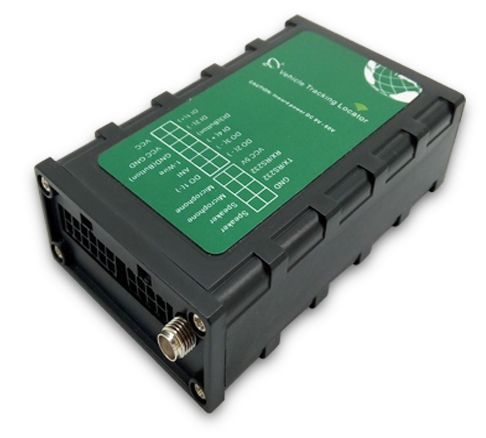

# Totemtech - AT07

The Totemtech AT07 GPS tracker is a versatile and reliable device that offers a wide range of features for effective tracking and monitoring. With the ability to send data to two servers simultaneously, you can ensure that your tracking information is always accessible and secure. The built-in 3-Axis Digital Accelerometer allows for movement status monitoring, providing valuable insights into the behavior and activity of the tracked object.

One of the standout features of the AT07 is its firmware upgrade capability via OTA \(Over-The-Air\), eliminating the need for manual updates and ensuring that you always have the latest features and improvements. The tracker supports a wide range of power inputs, from DC 9v to 50v, and features over-voltage protection for added safety and durability.

With the Totemtech AT07, you have full control over your GPS tracking experience. You can send commands to the tracker via GPRS or SMS, and send GPRS data to an IP or domain name of your choice. The device also includes 16Mb of Flash Memory, allowing for the storage of approximately 4000 data points.

Other notable features of the AT07 include fuel/oil level detection with high accuracy, voice monitoring function with a built-in microphone, and user-defined settings on I/O ports for digital input, digital output, and analog input. Whether you need to track vehicles, assets, or even people, the Totemtech AT07 GPS tracker is a reliable and feature-rich solution.

### Key Features:

- Simultaneous data transmission to two servers
- 3-Axis Digital Accelerometer for movement status monitoring
- Firmware upgrade via OTA
- Support for DC 9v to 50v power input with over-voltage protection
- GPRS and SMS command support
- 16Mb Flash Memory for data storage
- Fuel/oil level detection with high accuracy
- Voice monitoring function with microphone
- User-defined settings on I/O ports

