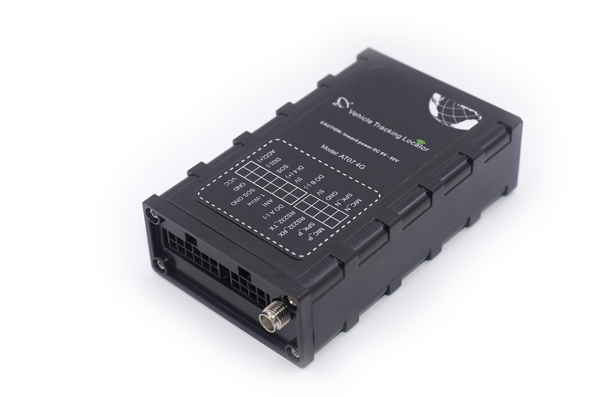

# Totemtech - AT07-4G

The AT07-4G \(also referenced as AT07-3G/4G\) is a compact, rugged GPS tracker engineered for demanding vehicle and asset deployments. Designed for reliable fleet management and anti-theft protection, the AT07-4G delivers Plaspy compatible real-time tracking, robust telemetry and flexible peripheral integration for fuel monitoring, door/ignition status, and emergency alerts.

Built to operate across multiple cellular variants and GNSS constellations, the AT07-4G combines persistent connectivity, onboard logging and OTA firmware upgrades to keep vehicles and assets visible under network loss or harsh conditions. Its compact form factor and wide power input range make it ideal for mixed fleets that require accurate position, diagnostics and event-driven reporting into Plaspy.

## Key Highlights

- Plaspy compatible GPS tracker with real-time tracking and historical trace logging for fleet management and asset visibility.
- Multi-constellation GNSS \(GPS/GLONASS/BeiDou\) using a 50-channel AT6558R chip for fast reacquisition and tight position accuracy.
- 3G/4G cellular variants and quad-band GSM with configurable GPRS reporting by time, distance or course change.
- Rich I/O for telemetry and peripherals: RS232 port for external sensors \(Omnicomm fuel meters, RFID\), 1-wire temperature input, digital/analog I/O and voice ports.
- Onboard 16MB flash memory stores ~4,000 records when the network is unavailable; OTA firmware upgrades and SMS/GPRS configuration supported.
- Comprehensive alarm set: geo-fencing, overspeed, SOS, door status, external power lost, towing, idle and vibration \(tremble\) detection.
- Wide power tolerance and protection with DC input options, built-in over-voltage protection and an 800 mAh high-temperature Li-Polymer backup battery.

## How It Works with Plaspy

When paired with Plaspy, the AT07-4G supplies continuous location and telemetry into your tracking platform. The device supports configurable reporting modes and can stream position and event data to up to two servers simultaneously. Plaspy ingests GPS/GLONASS/BeiDou fixes, I/O events and sensor telemetry to provide live maps, alerts and analytics for fleet managers.

- Real-time location and telemetry updates \(GNSS fixes, speed, heading\).
- Door, SOS, external power lost and other digital event statuses for anti-theft and security alerts.
- Fuel monitoring via RS232-connected fuel sensors \(Omnicomm compatibility\) and analog inputs for fuel-related telemetry.
- Remote immobilizer control via external relay \(optional peripheral\) and digital outputs where deployed in immobilization workflows.
- Temperature and auxiliary sensor data via 1-wire port and serial/analog interfaces, enabling environmental monitoring and asset condition tracking.

## Technical Overview

| Model | AT07-4G \(also referenced AT07-3G/4G\) |
| --- | --- |
| Connectivity | 3G/4G cellular; quad-band GSM support and multiple LTE band options |
| Bands / Variants | EG91-EX: FDD-LTE B1/B3/B8/B20/B28; WCDMA B1/B8; GSM B3/B8. EG91-NAX: FDD-LTE B2/B4/B5/B12/B13/B25/B26; WCDMA B2/B4/B5. |
| GNSS | GPS/GLONASS/BeiDou with AT6558R chip, 50 channels; sensitivity -162 dBm; horizontal accuracy typically 2.5 m \(SBAS 2.0 m; SBAS+PPP \<1–2 m depending on mode\). |
| GNSS Performance | Reacquisition ≈0.1 s; Hot/Warm start ≈1 s; Cold start ≈27 s. |
| Power & Battery | DC input 9–50 V \(spec sheet also lists +12–60 V / 1.5 A support\); built-in over-voltage protection; 800 mAh Li-Polymer backup battery rated for high temperatures. |
| Interfaces | 1 × RS232 serial port; 1 switch input; 4 digital inputs; 3 digital outputs; 1 analog input; 1 × 1-wire temperature sensor port; GPS antenna port; 1 SOS button; 4 two-way voice ports \(mic & speaker\). |
| Storage | 16 MB flash memory \(approx. 4,000 stored records\) for offline logging. |
| Indicators | LEDs for GPS, GSM and power status. |
| Dimensions & Weight | 89 × 55 × 25 mm; ~100 g. |
| Operating Conditions | -20 °C to 60 °C; humidity 5%–95% non-condensing. |
| Power Consumption | Typical 2 W normal, up to 12.5 W peak. |
| Package & Options | Standard package includes GPS antenna and I/O cable set. Optional peripherals: relay, door sensor, fuel sensor, camera, temperature sensor, microphone, speaker, buzzer, iButton/RFID readers & tags, LED lamp, weighing sensor, fuel consumption meter, Omnicomm compatibility. |
| Management & Integration | OTA firmware upgrades, configurable via SMS/GPRS/vendor software; supports connection to common tracking servers and platforms. |

## Use Cases

- Fleet management — continuous location, telematics and route history for trucks, vans and mixed fleets integrated into Plaspy dashboards.
- Anti-theft and immobilization — door/open alarms, external power loss alerts and relay-based immobilizer workflows to secure vehicles.
- Fuel monitoring and consumption analysis — RS232 support for Omnicomm and other fuel sensors plus analog inputs for granular fuel telemetry.
- Perimeter & asset protection — geo-fencing, towing and vibration \(tremble\) detection to detect unauthorized movement.
- Cold chain / temperature monitoring — 1-wire temperature sensor input and serial sensor support for environmental telemetry in Plaspy reports.

## Why Choose This Tracker with Plaspy

The AT07-4G is engineered to deliver dependable GPS tracking and rich telemetry where uptime and peripheral flexibility matter. As a Plaspy compatible GPS tracker, it brings fast GNSS fixes, configurable reporting and local data buffering to maintain continuity of records during transient network loss. Its wide power range, thermal-tolerant backup battery and durable form factor make it suitable for harsh vehicle environments.

For fleets focused on fuel monitoring, anti-theft measures and integrated sensor telemetry, the AT07-4G offers a practical balance of inputs, serial connectivity and optional peripherals. Plaspy can aggregate the tracker’s location, ignition/door events, fuel data and alarms into unified dashboards, alerts and reports — and can correlate external sensor streams \(including Bluetooth sensors where an ecosystem gateway is present\) with vehicle telemetry for fuller operational insight. The result is scalable, actionable fleet intelligence with secure anti-theft controls and remote management through Plaspy.

