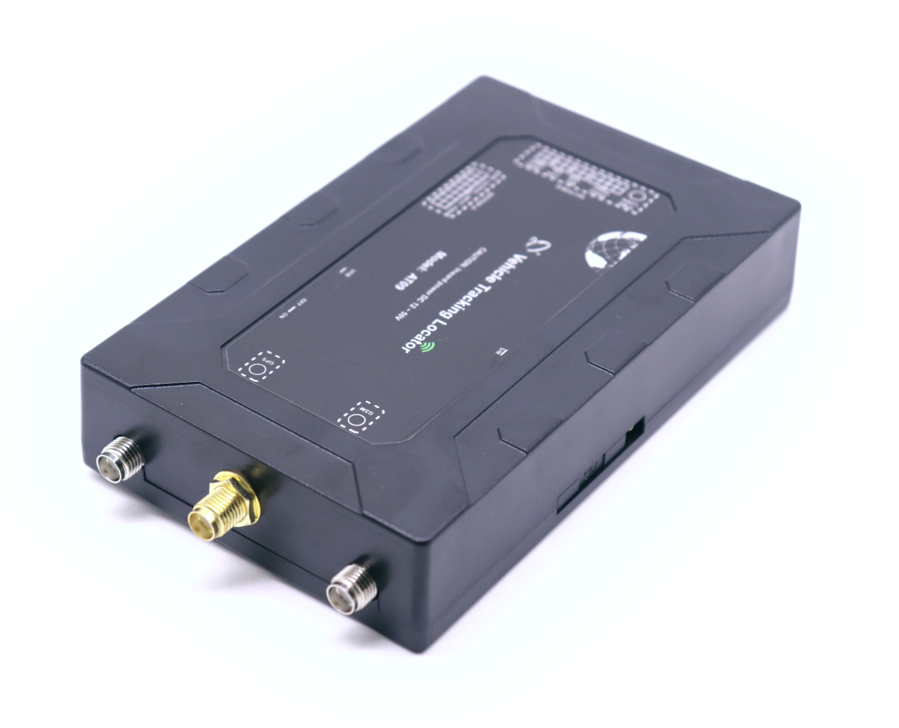

# Totemtech - AT09-4G

The Totemtech AT09-4G is a rugged 4G GPS tracker built for demanding vehicle environments including cars, trucks, trailers and heavy machinery. It combines multi-constellation GNSS positioning with vehicle condition sensing and broad peripheral support, making it suitable for fleet management, anti-theft and operational visibility in commercial and industrial applications.

Designed to be Plaspy compatible, the AT09-4G streams location and telemetry into fleet platforms like Plaspy to give dispatchers and managers real time situational awareness. Its combination of location, TPMS and multi-channel fuel monitoring, plus LoRa and Bluetooth connectivity, makes the device a practical option when Plaspy users need consolidated vehicle and sensor data in one platform.

## Key Highlights

- Real-time tracking with multi-constellation GNSS for reliable positioning in varied environments.
- Rugged design intended for cars, trucks, trailers and heavy equipment used in industrial settings.
- Built-in telemetry support including TPMS and multi-channel fuel monitoring for vehicle health and fuel oversight.
- Extensive connectivity options such as LoRa and Bluetooth to extend sensor coverage and integrate local peripherals.
- Flexible reporting and alarm capabilities for geofencing, overspeed, tamper and other event-driven notifications.
- Optional voice and video features plus Wi‑Fi hotspot capability to support driver communication and passenger connectivity.

## How It Works with Plaspy

When connected to Plaspy the AT09-4G delivers continuous position and telemetry streams that appear in the Plaspy platform for live monitoring and historical analysis. Plaspy ingests location coordinates, sensor readings and alarm events from the device so teams can track assets, respond to incidents and generate operational reports.

- Live location tracking and movement history for dispatch and route oversight.
- Alarm and event notifications such as geofence breaches, tamper or SOS alerts routed into Plaspy for immediate action.
- Vehicle condition telemetry including tire data and fuel levels shown alongside location to support maintenance and efficiency workflows.
- Integration of LoRa and Bluetooth sensor inputs so cargo, temperature or local IoT sensors feed into Plaspy dashboards.
- Configurable reporting frequency and triggers to balance data granularity with reporting costs and operational needs.

## Typical Use Cases

- Fleet management and logistics for delivery, transport and mixed vehicle fleets needing combined location and telemetry.
- Anti-theft and security applications using geofencing, tamper detection and remote alerting for vehicle recovery.
- Construction and mining equipment monitoring where rugged tracking and telemetry improve asset visibility.
- Passenger transport and school bus operations that require driver oversight and optional in-vehicle connectivity.
- Cold chain and regulated cargo monitoring using external sensors integrated via LoRa or Bluetooth.

## Why Choose This Tracker with Plaspy

The AT09-4G is a practical choice for organizations seeking a single device that consolidates location, vehicle telemetry and external sensor inputs into Plaspy. Its rugged construction and broad peripheral support make it adaptable across commercial fleets and heavy equipment, while onboard telemetry such as TPMS and multi-channel fuel monitoring helps reduce maintenance risk and improve operational insight.

To learn more about how Plaspy can use data from devices like the AT09-4G visit https://www.plaspy.com. Product specifications, availability and manufacturer details can change over time; please verify current specifications and options with the manufacturer at http://www.totemtek.com/.
