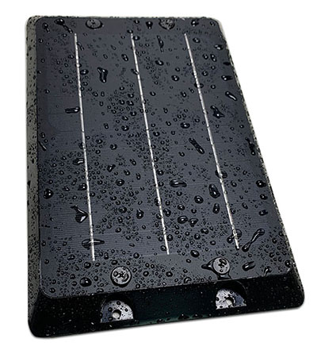

# Totemtech - AT21-4G

The AT21-4G is a rugged, solar powered 4G GPS tracker designed for long term remote asset monitoring. Built for trailers, containers, boxcars, mining equipment and other stationary or remote assets, the device combines a sealed IP67 enclosure, a large integrated solar panel and a high capacity internal battery to provide continuous, low maintenance telematics where permanent DC power is not available.

As a Plaspy compatible device, the AT21-4G can stream location, sensor and event data into Plaspy for live tracking, alerts and historical playback. Its offline logging and configurable reporting behavior make it suitable for deployments that need reliable situational awareness and reduced field servicing, while Plaspy visualizes and organizes the incoming telematics for fleet managers and asset custodians.

## Key Highlights

- Solar powered autonomy with a large integrated solar panel and a substantial internal battery for extended deployments without wired power.
- Compatible with Plaspy for real time tracking, telemetry, event alerts and historical playback using UDP, TCP or SMS data feeds.
- Rugged IP67 PC+ABS enclosure with optional removable magnets for exposed surface mounting and weather resistance.
- Multi GNSS positioning for faster fixes and improved accuracy suitable for long term asset monitoring.
- Ultra low power management and multiple sleep modes to extend autonomous field life and reduce maintenance visits.
- Flexible sensor and I O support including 1 wire temperature sensor, analog input and digital I O for fuel, ignition or immobilizer use cases.

## How It Works with Plaspy

The AT21-4G delivers location, sensor and event packets to Plaspy where the platform parses and aggregates those inputs into maps, alerts and reports. Plaspy uses the device streams and stored logs to provide visibility, replay and operational insight across distributed assets without requiring constant wired power on site.

- Real time location and telemetry updates flow into Plaspy for live monitoring and route playback.
- Digital I O and ignition status can be used to trigger alerts, immobilizer workflows and event based notifications within Plaspy.
- Analog sensor inputs support fuel level and other analog telemetry that Plaspy can include in reports and dashboards.
- Offline logging and store and forward behavior let Plaspy reconstruct tracks after connectivity gaps for accurate historical playback.
- Integrated temperature sensors, optional TPMS and RFID inputs are consolidated in Plaspy alongside GPS data for comprehensive asset context.
- When BLE sensor data is present via a separate gateway, Plaspy can correlate those readings with the AT21-4G location and events.

## Typical Use Cases

- Trailer and container tracking where solar charging and battery capacity reduce the need for wired power and frequent visits.
- Rail and boxcar asset supervision that benefits from a rugged IP67 enclosure and multi GNSS positioning.
- Remote machinery and mining equipment monitoring where DC power is intermittent and long term autonomy is required.
- Fleet anti theft and immobilization workflows using digital I O and ignition monitoring tied to Plaspy alerts.
- Cold chain and environmental monitoring using 1 wire temperature sensors and optional tire pressure monitoring.

## Why Choose This Tracker with Plaspy

The AT21-4G is well suited to organizations that need a low maintenance, weatherproof tracker for dispersed or hard to reach assets. Its combination of solar charging, robust enclosure and flexible sensor I O makes it a practical choice for deployments where uptime and reduced field servicing are priorities. Paired with Plaspy, the device provides the telemetry flow and offline recovery needed for reliable operational oversight and incident response.

If you want to evaluate fit for a specific deployment, Plaspy can ingest the AT21-4G data streams and present them in maps, alerts and reports that teams use for daily operations. Learn more about Plaspy on the main website https://www.plaspy.com. Product specifications, availability and manufacturer details can change over time, so verify current technical information with the manufacturer at http://www.totemtek.com/ .
