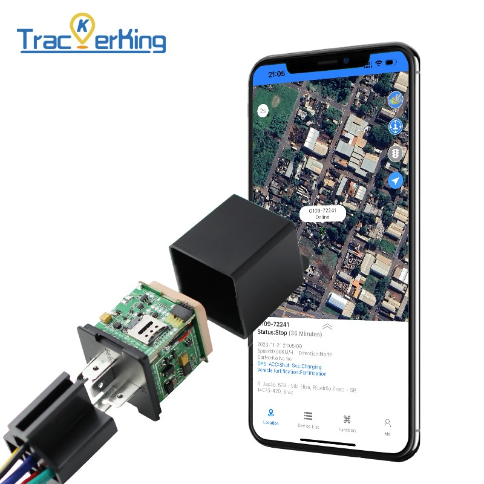

# TrackerKing - DK09

The DK09 is a Plaspy compatible 4G GPS tracker engineered for discreet vehicle anti-theft and reliable real-time tracking. Packaged to resemble a conventional relay, DK09 allows covert installation in cars and motorcycles while delivering continuous positioning, event alerts, and historical route playback to fleet managers and vehicle owners.

Designed for mixed vehicle fleets and heavy-duty equipment, the DK09 combines robust voltage tolerance \(9–90V\), an internal backup battery with power-failure alarm, and remote engine/oil cut-off control to provide fast theft response and practical telemetry for fleet management. When paired with Plaspy, this GPS tracker becomes a complete solution for monitoring location, ignition state, movement alarms, and route history.

## Key Highlights

- Plaspy compatible 4G GPS tracker for accurate real-time tracking and history playback.
- Discreet relay-style form factor for covert installation in cars, motorcycles, and equipment.
- Remote engine and oil cut-off \(immobilizer\) capability for immediate anti-theft response.
- Comprehensive alarm suite: movement/vibration alarm, overspeed alarm, geo-fence alerts, and ACC ignition detection.
- Wide input voltage range \(9–90V\) and internal battery that triggers a power-failure alarm on external power loss.
- Mileage statistics and route logging to support fleet management and operational reporting.
- Purpose-built for vehicle anti-theft, fleet tracking, and telemetry-driven monitoring workflows.

## How It Works with Plaspy

When integrated with Plaspy, the DK09 transmits position and event data over 4G to the Plaspy platform for real-time tracking, automated alerts, and detailed reporting. Plaspy ingests the tracker’s telemetry so fleet managers can view live locations, review historical routes, and respond to alarms from a central dashboard or mobile app. This combination enables proactive anti-theft actions and operational oversight across diverse vehicle types.

- Real-time location and telemetry updates delivered via 4G to Plaspy for continuous monitoring.
- Ignition \(ACC\) status and relay control for immobilizer actions and remote engine/oil cut-off.
- Geo-fence, overspeed, movement, and vibration alerts routed through Plaspy for immediate notifications.
- Historical route playback and mileage statistics available for fleet reporting and incident review.
- Works with Plaspy’s telemetry features; integration with fuel monitoring or Bluetooth sensors can be implemented where external sensors are present and supported by the installation.

## Technical Overview

| Connectivity | 4G cellular data for real-time tracking and telemetry reporting |
| --- | --- |
| Bands | 4G \(regional band support varies by model and market; consult manufacturer or distributor\) |
| Power & Battery | Wide input voltage range 9–90V; internal backup battery with power-failure alarm |
| Interfaces | Relay-style mounting; supports remote engine/oil cut-off \(immobilizer control\) and ACC ignition detection |
| GNSS | GPS positioning for continuous location and historical route playback |
| Bluetooth | Not specified in product description |
| Remote Management | Remote monitoring and control \(engine/oil cut-off\) via Plaspy integration; FOTA not specified |
| Form Factor | Disguised as a conventional relay for covert installation in vehicles and equipment |

## Use Cases

- Fleet management: Monitor vehicle locations, mileage statistics, and route history for scheduling and compliance.
- Vehicle anti-theft: Covert installation and remote immobilizer \(engine/oil cut-off\) reduce theft risk and speed recovery.
- Motorcycle tracking: Small relay-style footprint allows discreet mounting on two-wheel vehicles while maintaining real-time tracking.
- Heavy equipment monitoring: Wide 9–90V input and power-failure alarm make DK09 suitable for construction machinery and generators.
- Operational alerts: Overspeed, geo-fence, movement, and ACC alarms automate safety and misuse notifications across a fleet.

## Why Choose This Tracker with Plaspy

Choosing the DK09 as a Plaspy compatible GPS tracker gives fleet managers and vehicle owners a discreet, reliable tool for real-time tracking and anti-theft protection. Its relay-style housing simplifies covert installation while delivering the key telemetry and alarm functions needed for modern fleet management. The wide input voltage range and internal battery provide resilience on light vehicles and heavy-duty equipment alike, and the remote engine/oil cut-off offers a practical immobilizer mechanism when a theft response is required.

Integrated into Plaspy, DK09’s location data and event alerts become actionable intelligence: live tracking, automated telemetry reports, geo-fence enforcement, and route playback help you reduce risk, optimize operations, and recover assets faster. For organizations that require dependable anti-theft capabilities, real-time tracking, and robust vehicle telemetry, DK09 presents a purpose-built, Plaspy compatible option that balances discretion with operational control.

