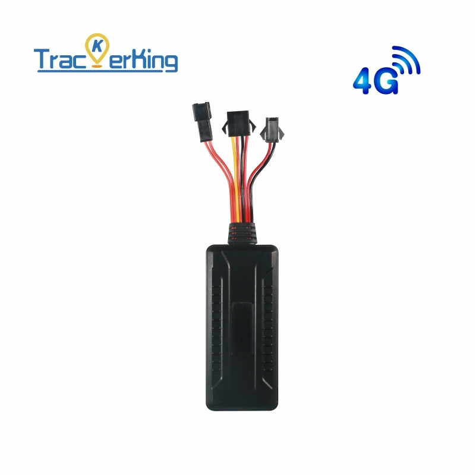

# TrackerKing - DK17

The DK17 is a professional vehicle GPS tracker from TrackerKing designed for reliable real time tracking and fleet management. As a wired vehicle tracker with 4G plus 2G Cat 1 cellular connectivity, it delivers continuous location updates, mileage statistics and a set of security and remote control features suited to commercial fleets, rental vehicles and anti theft deployments. The unit is engineered to maintain operation across a broad input voltage range and includes an internal backup battery to preserve tracking through power interruptions.

Because the DK17 is explicitly compatible with Plaspy, it is a practical option for operators who want to centralize vehicle visibility and control. The device streams telemetry and event reporting that Plaspy can use for live dashboards, automated alerts and historical playback. Built in inputs for ignition detection and support for remote engine or fuel cutoff and tamper alarm reporting make the DK17 a fit for deployments that need both monitoring and basic remote actions through a unified platform.

## Key Highlights

- Plaspy compatible for real time location updates and route history playback on a single platform
- 4G plus 2G Cat 1 cellular connectivity for consistent communications and wide area coverage
- Wide 9–90V operating range with internal backup battery to maintain tracking after power loss
- ACC ignition detection and mileage statistics for accurate usage and run time logging
- Remote immobilizer and tamper alarm features to enhance vehicle security workflows
- Geo fence and overspeed alerts to automate boundary and speed notifications via Plaspy
- Optional remote voice monitoring support using an external microphone for situational verification

## How It Works with Plaspy

When installed and connected to mobile networks, the DK17 streams position and event data into Plaspy so operators can monitor fleets from a centralized dashboard. Plaspy ingests the tracker telemetry and event triggers to power live tracking, alerts and historical reports, enabling teams to act on security events and operational exceptions more quickly.

- Real time location and telemetry updates appear in Plaspy for live tracking and dispatching
- Alarm events such as SOS, vibration, geo fence and overspeed are forwarded as Plaspy alerts
- Mileage statistics and battery voltage data support routine diagnostics and reporting in Plaspy
- Remote immobilizer commands can be issued from the platform where supported by the installation
- Event history and route playback in Plaspy enable audits, investigations and performance analysis
- Remote voice monitoring can be used in Plaspy workflows when an external microphone is fitted

## Typical Use Cases

- Fleet management with live vehicle tracking, route history and mileage logging
- Car rental monitoring for ignition detection, geo fences and usage reconciliation
- Anti theft deployments using vibration alarms, SOS alerts and remote immobilizer controls
- Long term asset tracking and history playback for audits and lifecycle monitoring
- Security and compliance workflows that benefit from event logging and optional voice checks

## Why Choose This Tracker with Plaspy

The DK17 is suited to organizations that require dependable vehicle tracking combined with practical security and control features. Its broad voltage tolerance and internal backup battery help ensure continuous reporting across diverse vehicle fleets, and its alarm and immobilizer capabilities support common anti theft and operational control needs. Paired with Plaspy, the DK17 provides centralized visibility and standardized alerting that simplify fleet oversight and incident response.

If you are evaluating Plaspy compatible hardware for fleet or vehicle security use cases, the TrackerKing DK17 is a capable option to consider. Learn more about Plaspy on the main website https://www.plaspy.com. Product specifications, availability and manufacturer details can change over time, so verify current technical information on the official TrackerKing site https://trackerking.cn/ before making deployment decisions.
