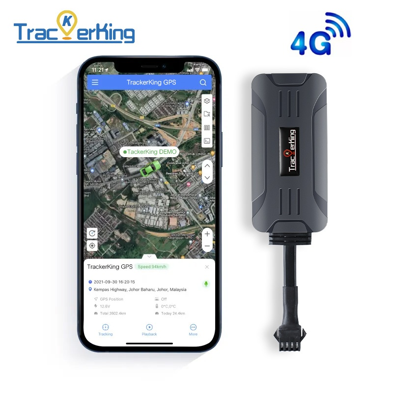

# TrackerKing - DK19

The DK19 is a compact 4G GPS tracker designed for reliable vehicle anti theft protection and fleet management. It provides real time tracking and robust telemetry intended for cars, motorcycles and other powered vehicles where covert installation and continuous monitoring are priorities. The device description highlights location reporting, ignition state detection and security event monitoring as core capabilities, along with mileage statistics useful for fleet oversight.

As a Plaspy compatible device out of the box, the DK19 can be integrated into Plaspy to centralize live tracking, alerts and reporting. Its support for standard tracking protocols and fallback connectivity options helps ensure consistent telemetry delivery to the Plaspy platform, enabling fleet managers and private owners to monitor location, ignition and security events from a single dashboard.

## Key Highlights

- Plaspy compatible for straightforward platform integration and onboarding, supporting common protocols GT06, CRX3, JT808 and Tianqin.
- Neoway 4G Cat 1 connectivity with optional Cat M and NB IoT support, and automatic fallback to 2G for broader coverage.
- Vehicle anti theft capabilities including remote cut off control for engine and fuel plus ACC ignition detection for immobilizer workflows.
- Blind area retransmission for improved continuity of location data in weak signal zones such as tunnels and parking garages.
- Built in alarm types for fleet security and monitoring including vibration alarm, geo fence breach alerts and overspeed notifications.
- Mileage statistics and odometer reporting to support fuel monitoring and operational audits.
- Wide operating voltage and compact, covert form factor suitable for a variety of powered vehicles.

## How It Works with Plaspy

Integration with Plaspy is designed to be straightforward: once the DK19 streams its telemetry and event packets, Plaspy parses those inputs and presents them on maps, dashboards and reports. Fleet administrators can use Plaspy to create rules and workflows that respond to DK19 events, improving situational awareness and operational response.

- Real time location and telemetry updates feed Plaspy for live map tracking and centralized dashboard monitoring.
- ACC ignition detection and virtual ignition reporting provide engine on/off context for driver behavior and utilization analysis.
- Remote immobilizer and fuel cut off control can be executed and logged through Plaspy as part of anti theft response procedures.
- Blind area retransmission helps maintain route continuity and Plaspy displays retransmitted points alongside live tracking data.
- Protocol compatibility ensures Plaspy can interpret standard packets to show alarms, mileage statistics and common telemetry fields.

## Typical Use Cases

- Fleet anti theft and rapid immobilization workflows for stolen or compromised vehicles.
- Driver behavior monitoring and fleet management using ignition events, overspeed alerts and mileage reporting.
- Covert vehicle protection where a compact form factor and blind area retransmission improve tracking continuity.
- Route history playback and compliance reporting to support audits and service verification.
- Monitoring service vehicles and mobile assets for dispatch and operational oversight.

## Why Choose This Tracker with Plaspy

The DK19 combines vehicle focused features with broad protocol compatibility, making it a practical choice for organizations that want reliable telemetry inside Plaspy. Its 4G core with fallback and optional LPWAN support helps maintain continuous data flow across varied coverage environments, while built in ignition detection and anti theft controls translate directly into actionable events and automations inside Plaspy.

For teams that prioritize quick onboarding, consistent tracking and consolidated fleet visibility, the DK19 offers a balanced hardware profile that aligns with Plaspy workflows for real time monitoring, alerts and reporting. Learn more about Plaspy on the main website https://www.plaspy.com. Product specifications, availability and manufacturer details can change over time, so please verify current specifications with TrackerKing documentation at https://trackerking.cn/.
