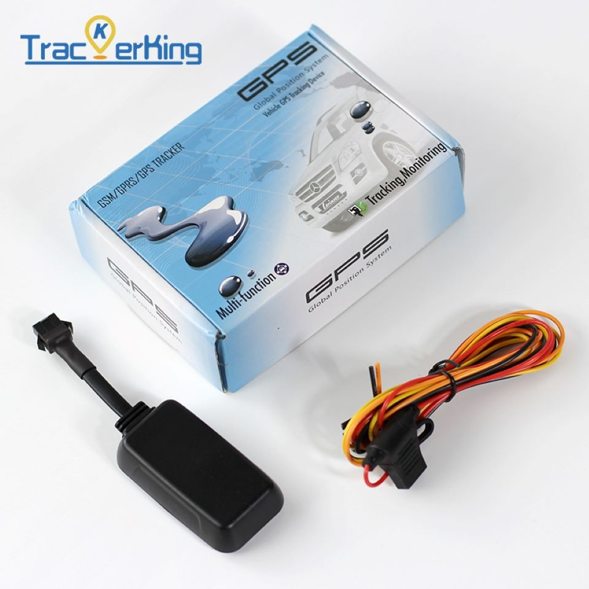

# TrackerKing - EC33

The TrackerKing EC33 is a compact pure 4G GPS tracker designed for reliable real time tracking. As TrackerKing’s smallest 4G device, the EC33 is intended for vehicles and mixed fleets including cars and motorcycles. It combines core telemetry and safety features such as ignition detection, remote engine and fuel cutoff, vibration and geo fence alarms, overspeed alerts, and a substantial onboard memory cache to preserve location history when connectivity is interrupted.

Because the EC33 supports modern 4G connectivity and the widely used GT06 protocol, it is a natural fit for Plaspy compatible deployments. Plaspy can ingest the EC33’s location and event streams to provide live maps, alerts, history playback and reporting, making the device suitable for fleet monitoring, anti theft protection, and personal vehicle tracking within the Plaspy platform.

## Key Highlights

- Pure 4G GPS tracker optimized for real time tracking and fast integration via the GT06 protocol.
- Very compact form factor suitable for discreet placement on cars and motorbikes.
- Anti theft capability including remote engine and fuel cutoff and vibration alarm features.
- Large onboard memory with an 8000 point cache to retain positions during network outages.
- Broad operating voltage support and external battery detection for versatile vehicle use.
- Dual IP and IP lock support for improved delivery and server redundancy.
- History route playback and mileage statistics for reporting and operational oversight.

## How It Works with Plaspy

The EC33 streams GPS positions, status events, and telemetry using GT06 compatible messages that Plaspy can receive and translate into live location views, alerts, and reports. When network connectivity is lost, the device’s cached points and blind area retransmission ensure Plaspy can recover missed routes and maintain continuity in trip records once the device reconnects.

- Live location, speed, and heading updates appear in Plaspy for dispatch and monitoring.
- Ignition and virtual ignition events are used by Plaspy for trip logging and engine on off workflows.
- Remote immobilizer controls can be managed through Plaspy when authorized by your organization.
- Alarms such as vibration, geo fence breaches, overspeed, and power loss are forwarded to Plaspy alerting.
- History playback and odometer or mileage summaries synchronize with Plaspy for compliance and reporting.

## Typical Use Cases

- Fleet management with live tracking, mileage reporting, and route playback for operations teams.
- Anti theft protection using remote immobilizer, vibration alerts, and power failure notifications.
- Personal vehicle and motorcycle tracking for owners who need discreet monitoring and trip history.
- Telemetry and fuel monitoring workflows that rely on ignition events and remote cutoff capabilities.
- Mixed vehicle deployments where a wide voltage range allows the same tracker across different vehicle types.

## Why Choose This Tracker with Plaspy

The EC33 is a practical choice for organizations that need a compact, resilient tracker that integrates smoothly with Plaspy. GT06 compatibility helps speed integration, while dual IP options and a large onboard cache reduce the risk of data gaps in real world operating conditions. Its anti theft features and event reporting feed directly into Plaspy alerting and control workflows, supporting rapid response and loss prevention.

If you are evaluating devices for vehicle or motorcycle tracking within Plaspy, the EC33 offers a balance of discreet hardware, event continuity, and useful fleet reporting features. Learn more about Plaspy on the main website https://www.plaspy.com. Product specifications and availability can change over time, so verify current technical details and compatibility on the manufacturer site https://trackerking.cn/.
