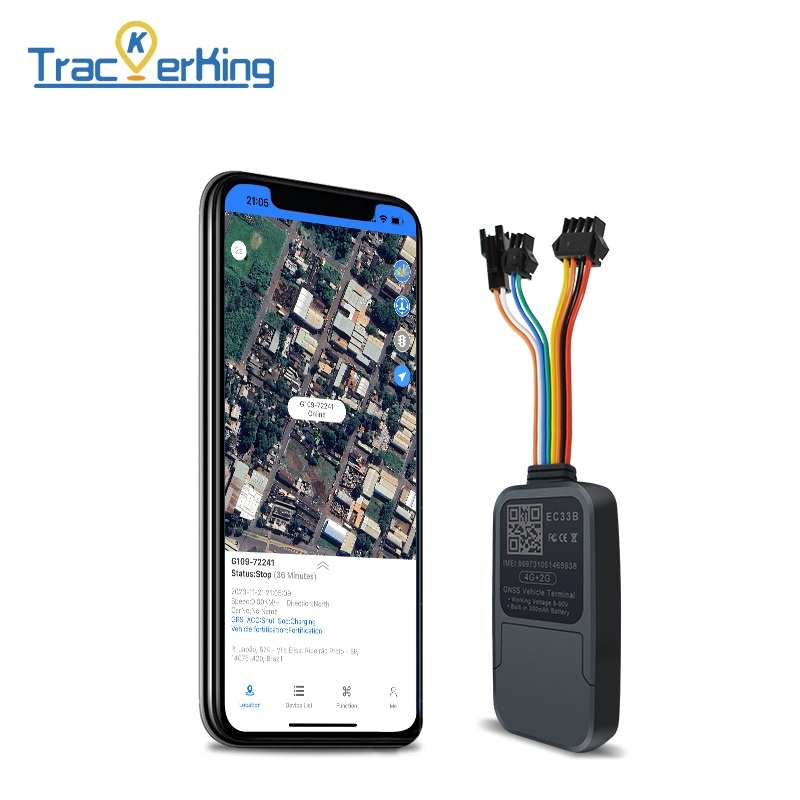

# TrackerKing - EC33B

The EC33B is a compact, multi-function 4G GPS tracker designed for reliable vehicle and asset monitoring and fully compatible with Plaspy. Built around a Quectel 4G Cat-1 module with automatic fallback to 2G, the EC33B delivers continuous real-time tracking and history route playback so fleets and individual owners can monitor location, mileage and status from a single Plaspy dashboard.

Optimized for fleet management, anti-theft protection and telemetry-driven operations, the EC33B provides a wide 9–90V working range, ACC ignition detection, remote engine and fuel cut-off, and a suite of alarm inputs for vibration, geofence, overspeed and SOS events. When paired with Plaspy, this tracker becomes a dependable component in a scalable tracking solution that preserves offline data, supports remote control actions and feeds actionable reports for operations teams.

## Key Highlights

- Plaspy compatible for unified GPS tracker management, reporting and alerts.
- 4G Cat-1 connectivity with automatic 2G fallback to maintain real-time tracking in variable coverage areas.
- Robust offline data handling: caches up to 8,000 data points to prevent loss of history during signal gaps.
- Wide 9–90V input supports cars, trucks and commercial vehicles without additional converters.
- Advanced telematics features including ACC ignition detection, virtual ignition, mileage/odometer statistics and blind-area retransmission.
- Remote immobilizer capability via engine and fuel cut-off for anti-theft and fleet control interventions.
- Multiple alarm types and remote voice monitoring via external microphone and SOS cable for safety and emergency response.

## How It Works with Plaspy

Integrating the EC33B with Plaspy combines the device’s reliable telemetry stream with Plaspy’s platform-level tools for real-time tracking, alerts, route playback and fleet analytics. The EC33B communicates over standard tracking protocols \(GT06 supported\) and can be configured via USB; Plaspy ingests location, status and alarm messages to present them in dashboards, maps and reports.

- Real-time location and telemetry updates delivered to Plaspy for monitoring and route playback.
- ACC ignition and virtual ignition status reported to Plaspy for driver behavior and engine-on reporting.
- Fuel control and immobilizer actions: remote engine/fuel cut-off commands from Plaspy for anti-theft response and operational control.
- External battery voltage detection and internal battery power-failure alarm reported as telemetry and alerts in Plaspy.
- Event-driven alerts \(vibration, geofence, overspeed, SOS\) pushed to Plaspy for immediate notifications and escalations.
- Offline data cache \(up to 8,000 points\) retransmitted to Plaspy after coverage restoration to preserve historical accuracy.

## Technical Overview

| Model | EC33B |
| --- | --- |
| Connectivity | Quectel 4G Cat-1 module with automatic fallback to 2G |
| Protocol & Configuration | Supports GT06 protocol; USB configuration supported |
| Offline Storage | Caches up to 8,000 offline data points for blind-area retransmission |
| Power & Battery | Working voltage 9–90V; external battery voltage detection and internal backup battery with power-failure alarm |
| Interfaces | ACC ignition detection and virtual ignition support; remote engine and fuel cut-off; external microphone and SOS cable input; multiple alarm inputs \(vibration, geofence, overspeed, SOS\) |
| GNSS | GPS-based real-time location and history route playback \(GNSS type not specified\) |
| Bluetooth | Not specified \(device uses wired connections for microphone/SOS; platform-level Bluetooth integration depends on gateway or platform features\) |
| Remote Management | USB configuration; compatible with common tracking platforms using standard protocols; supports blind-area retransmission and remote control commands |
| Form Factor | Compact wired tracker for vehicle and asset installation |

## Use Cases

- Fleet management: continuous real-time tracking, mileage/odometer reporting and ignition-based analytics for cars, vans and trucks.
- Anti-theft and remote immobilization: remote engine and fuel cut-off via Plaspy to secure stolen or misused vehicles.
- Telemetry and operations: external battery and power-failure alarms, overspeed and geofence alerts for compliance and safety monitoring.
- Emergency response and safety: SOS cable and external microphone enable remote voice monitoring and rapid alerting for driver safety incidents.
- Asset tracking in low-coverage areas: offline data caching and blind-area retransmission ensure no loss of historical movement data.

## Why Choose This Tracker with Plaspy

The EC33B is a practical choice when you need a compact, Plaspy compatible GPS tracker that balances continuous real-time tracking with resilient offline behavior. Its 4G Cat-1 connectivity plus automatic 2G fallback provides stable communications across urban and rural routes, while the 9–90V input supports diverse vehicle types without extra hardware. For operations teams, EC33B’s ACC detection, mileage statistics and remote immobilizer functions mean Plaspy can deliver meaningful fleet management, anti-theft and telemetry outcomes.

Beyond core GPS tracker functions, the EC33B prioritizes data integrity \(8,000-point cache\) and safety features \(SOS, external microphone\) that integrate into Plaspy’s notification and reporting workflows. Whether you are rolling out a small commercial fleet, securing high-value assets or adding anti-theft controls, pairing the EC33B with Plaspy gives you dependable real-time tracking, historical route playback and actionable telemetry — all managed from a single platform for operational efficiency.

