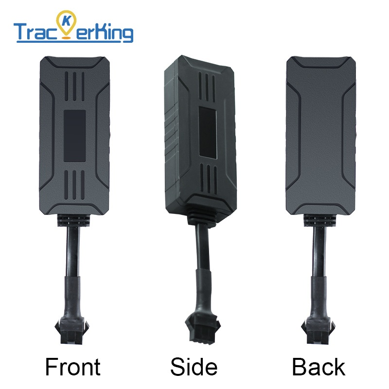

# TrackerKing - G109

The TrackerKing G109 is a 4G GPS tracker designed for reliable vehicle and motorcycle tracking with a focus on anti theft and anti loss protection. Built for continuous real time tracking and history route playback, the G109 provides timely location updates and vehicle telemetry suited to cars, motorcycles, and trucks. Its feature set emphasizes resilience during power interruptions and the ability to recover tracks from low coverage areas.

As a Plaspy compatible device, the G109 integrates with Plaspy to deliver live position updates, alarm notifications, and trip history into the Plaspy platform. That compatibility makes it a practical option for operators and fleet managers who want to combine the tracker hardware capabilities with Plaspy’s dashboards, alerting, and reporting tools for operational oversight and security workflows.

## Key Highlights

- Plaspy compatible 4G GPS tracker for real time visibility across vehicles and motorcycles
- Wide working voltage supports a broad range of vehicle power systems for mixed fleets
- Internal long life backup battery and power failure alarm keep reporting during tampering or power loss
- Remote engine and fuel cut off immobilizer capability for rapid anti theft response
- ACC ignition detection and mileage odometer reporting for trip and usage monitoring
- Blind area retransmission and history route playback to reconstruct offline segments
- Vibration, geo fence and overspeed alarms for asset protection and safety enforcement

## How It Works with Plaspy

When connected to Plaspy, the G109 streams location and vehicle status into the platform so operators can monitor live positions, receive alarms, and review historical trips from a single interface. Plaspy consumes the device’s event data to support notifications, reporting, and remote operational controls where configured.

- Real time location and telemetry fed into Plaspy for mapping and dispatch visibility
- Ignition status reporting to indicate vehicle on and off state for activity monitoring
- Immobilizer controls available from Plaspy for authorized anti theft response when configured
- Alarm events such as vibration, geo fence breach, overspeed and power failure forwarded to Plaspy for immediate notification
- History route playback and blind area retransmission used in Plaspy to reconstruct trips and offline segments

## Typical Use Cases

- Fleet management with live tracking, mileage reporting and route playback for operational efficiency
- Vehicle anti theft and recovery combining vibration alerts and remote immobilization via Plaspy
- Mixed vehicle fleets where wide voltage support simplifies device selection across cars, trucks and motorcycles
- Personal vehicle security and monitoring using geo fence and power failure alerts for suspicious activity

## Why Choose This Tracker with Plaspy

The G109 provides the core features operators expect for vehicle and motorcycle tracking while offering resilience for common field conditions. Its internal backup battery, wide operating voltage range, and basic anti theft inputs make it a practical choice for organizations that need dependable reporting and straightforward anti theft workflows integrated into Plaspy.

Paired with Plaspy, the G109 becomes part of a managed telemetry solution that supports immediate alerts, immobilization workflows where enabled, mileage based reporting, and historical route analysis. For teams seeking a focused, integration friendly tracker for fleet visibility and vehicle security, the G109 is a compatible option to consider.

Learn more about Plaspy on the main website https://www.plaspy.com. Product specifications, availability, and manufacturer details can change over time, so please verify current specifications and official documentation on the manufacturer website https://trackerking.cn/.
