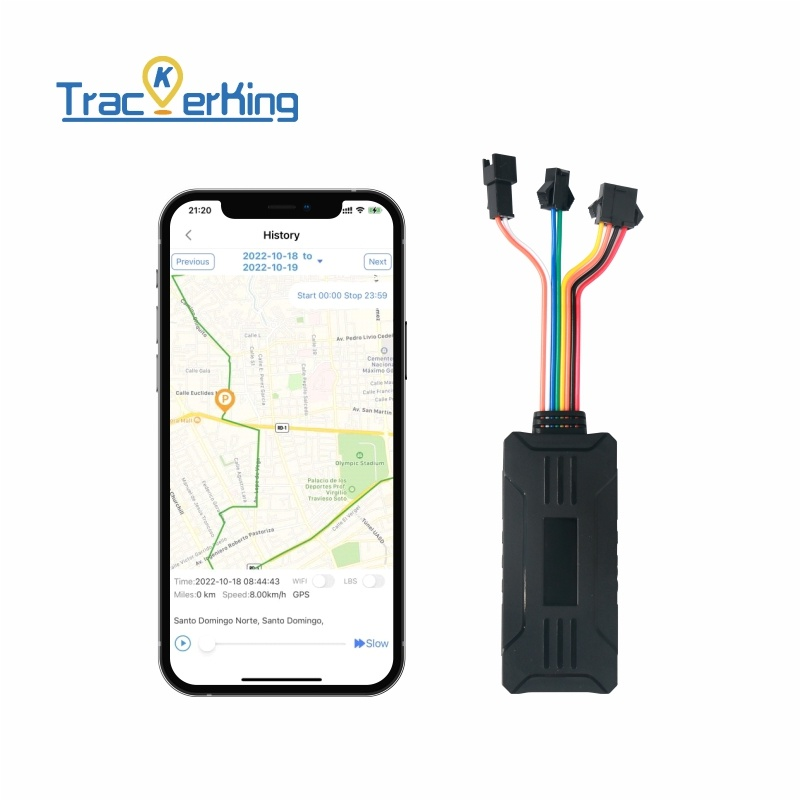

# TrackerKing - G909

The TrackerKing G909 is a wired vehicle GPS tracker designed for continuous positioning and remote control. Intended for direct installation in cars and motorcycles, the G909 provides real time tracking, event reporting and remote command capabilities while remaining compact and suited to permanent installation environments.

As a Plaspy compatible device, the G909 integrates with the Plaspy platform to surface location, telemetry and security events in a centralized dashboard and through platform APIs. This compatibility makes the G909 a practical option for fleet operators and vehicle owners who need managed tracking, alerting and remote immobilization as part of their Plaspy deployment.

## Key Highlights

- Plaspy compatible GPS tracker for real time tracking and centralized platform management
- Hardwired 9–36V design with internal backup battery to detect power loss and improve uptime
- ACC ignition detection and mileage reporting to support trip analysis and usage monitoring
- Multiple alarm types including SOS vibration geo fence and overspeed for timely incident alerts
- Remote immobilizer via engine or oil cut off for anti theft response and asset recovery
- History route playback to review past trips and operational patterns within Plaspy
- Remote voice monitoring using an external microphone for on site verification when required

## How It Works with Plaspy

When installed and registered on Plaspy, the G909 sends periodic telemetry and event driven updates so managers can monitor vehicles in real time and act on alerts. Plaspy ingests those updates to provide visibility, reporting and remote command workflows across a single fleet view.

- Real time location and telemetry updates in Plaspy for continuous situational awareness
- ACC ignition status reporting for trip detection start stop events and ignition based reports
- Mileage statistics and voltage monitoring to support maintenance planning and diagnostics
- Alarm events such as SOS vibration geo fence and overspeed forwarded to Plaspy for alerting
- Remote immobilizer control through Plaspy to disable a vehicle when operationally required
- History route playback and reporting inside Plaspy to analyze trips and vehicle usage

## Typical Use Cases

- Fleet management for continuous location monitoring mileage reporting and utilization analysis
- Anti theft protection using real time alarms plus remote immobilizer to secure assets
- Motorcycle and small vehicle protection where a compact hardwired tracker offers tamper resistance
- Operational oversight with route playback and ignition telemetry for driver and trip audits
- Remote safety and response with SOS alerts vibration detection and voice monitoring options

## Why Choose This Tracker with Plaspy

The G909 is a focused solution for organizations that need a permanently installed, tamper resistant tracker with practical remote control features. Its hardwired design and internal backup battery help maintain uptime and provide power loss alerts, while ignition detection and mileage reporting supply the basic telemetry fleets rely on for operations and maintenance planning.

Paired with Plaspy, the G909 becomes part of a managed tracking environment where alerts, history playback and remote commands are available through a centralized platform. For businesses and vehicle owners seeking a straightforward, Plaspy compatible tracker that balances reliability and essential control functions, the G909 is a suitable choice.

To learn more about Plaspy and how the G909 can integrate with fleet workflows visit https://www.plaspy.com. Product specifications and availability can change over time so verify the latest technical details and official documentation on the manufacturer website https://trackerking.cn/.
