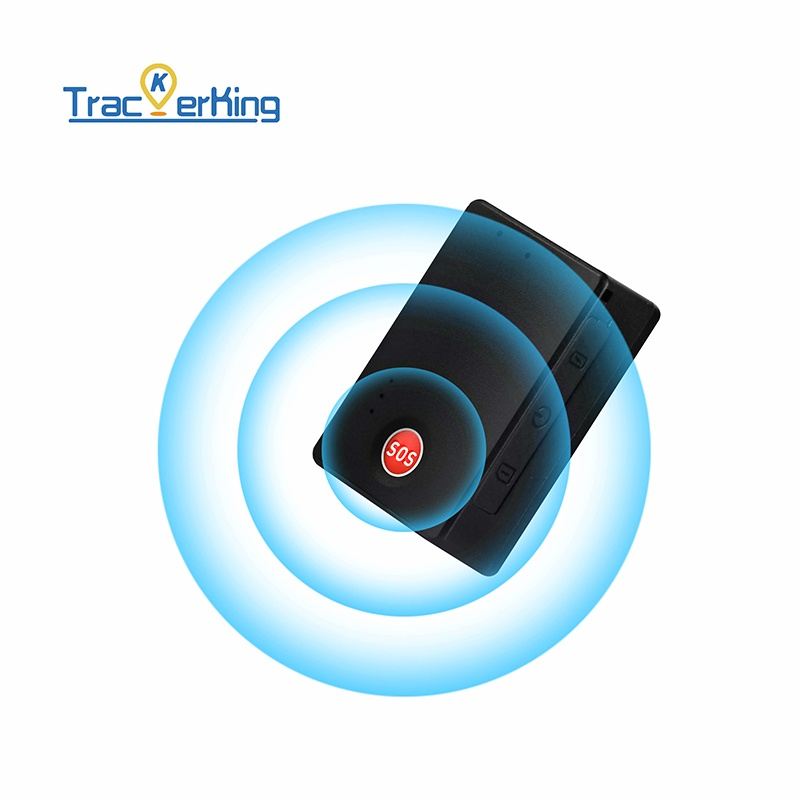

# TrackerKing - JX01

The JX01 is a compact, rechargeable personal GPS tracker designed for anti loss and personal protection. Its small form factor and 850 mAh battery make it suitable for handheld use or temporary attachment to luggage, pets, and portable assets. The device offers dependable location reporting, multiple real-time alarm types, and remote configuration through a companion app without the need for hardwiring.

As a Plaspy compatible device, the JX01 feeds location and event data into Plaspy dashboards and reports, making it useful where centralized visibility and timely response are important. Geofence alerts, movement and vibration notifications, low battery telemetry, and voice monitoring events can be surfaced in Plaspy to help administrators, caregivers, and recovery teams act quickly when incidents occur.

## Key Highlights

- Plaspy compatible personal GPS tracker for anti loss and safety monitoring
- Rechargeable 850 mAh battery for extended standby and portable operation
- Quad band GSM connectivity for broad cellular coverage and real time tracking
- Multiple real time alarms including movement, vibration, and geofence alerts
- Voice monitoring for situational awareness in emergency contexts
- Compact and portable form factor suitable for people, pets, luggage, and small assets

## How It Works with Plaspy

When paired with Plaspy, the JX01 supplies near real time location and event information so teams can visualize movement, receive instant notifications, and retain historical telemetry for review. Plaspy ingests the device reports and alarm events, enabling centralized alerting, mapping, and operational reporting across personal and mixed asset deployments.

- Real time location and battery status appear in Plaspy for mapping and operational oversight
- Movement and vibration alarms trigger instant notifications to administrators and caregivers
- Geofence entry and exit events are logged and shown in Plaspy alerts and reports for rapid response
- Voice monitoring events are registered in Plaspy to provide context during incidents
- Remote configuration changes from the companion app are reflected in device telemetry and reporting

## Typical Use Cases

- Personal safety tracking for children, caregivers, or lone workers
- Pet and luggage protection with geofence and movement alerts for fast recovery
- Temporary tracking of portable assets such as cameras, tools, or rental equipment
- Travel and transient security monitoring with low battery and motion notifications
- Short term or event deployments where handheld or attachable tracking is needed

## Why Choose This Tracker with Plaspy

The JX01 is a purpose built personal tracker that complements Plaspy by adding reliable, portable tracking and timely alarms for non wired scenarios. Its rechargeable design and configurable power modes help balance update frequency and runtime for users who need discreet, mobile monitoring. Paired with Plaspy, the device becomes part of a larger tracking workflow that centralizes alerts, maps events, and preserves telemetry for operational review.

If you want to learn more about how the JX01 can fit into your Plaspy deployment, visit the Plaspy main website https://www.plaspy.com. Product specifications, availability, and manufacturer details can change over time, so confirm current technical information and purchasing options on the official TrackerKing site https://trackerking.cn/.
