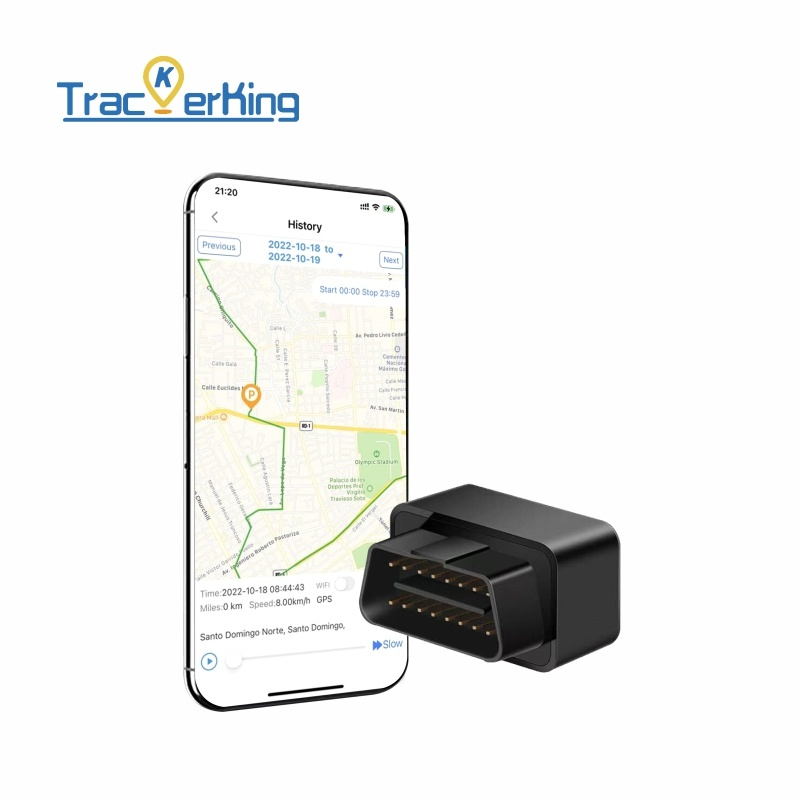

# TrackerKing - JX03

The JX03 is a compact, plug-and-play OBDII GPS tracker designed for straightforward vehicle installation and reliable Plaspy compatible operation. Built to draw continuous power from the vehicle’s OBDII port, the JX03 eliminates the need for a separate battery and provides uninterrupted real-time tracking and route history reporting for cars and compatible motorcycles where 2G GSM coverage is available.

The JX03 pairs easily with standard tracking platforms and integrates with Plaspy for centralized monitoring, helping fleet managers and vehicle owners deploy anti-theft measures, telemetry-based oversight, and driver behavior monitoring without complex wiring. Its small form factor and OBDII connector make concealment and serviceability simple, while core alerts such as geo-fence, overspeed, tamper/remove, and vibration detection deliver essential protection and operational visibility.

## Key Highlights

- Plaspy compatible plug-and-play OBDII GPS tracker for fast installation and integration.
- Continuous vehicle-powered operation—no separate battery to maintain.
- Real-time tracking and reliable route history playback for fleet management and asset supervision.
- Configurable geo-fence enter/exit alerts plus overspeed notifications to enforce policies and improve safety.
- Anti-theft protection with tamper/remove alarm and vibration detection for theft prevention.
- Street map view support for clear visual tracking on web and mobile platforms.
- Small form factor that conceals in the OBDII port, reducing tampering and visibility.

## How It Works with Plaspy

When connected to Plaspy, the JX03 transmits location and status information over the 2G network to provide continuous telemetry and event reporting. Plaspy accepts the device’s standard tracking data to present live position, historical trips, and alert events on a centralized dashboard or mobile app. This combination supports real-time tracking use cases and allows operators to receive notifications and run reports from one platform.

- Real-time location updates and route history playback for operational visibility.
- Geo-fence enter/exit alerts configured through Plaspy for automated location-based notifications.
- Overspeed alerts to monitor driver behavior and support safety programs.
- Tamper/remove and vibration detection events routed to Plaspy for anti-theft response.
- Street map view compatible with Plaspy’s web and mobile visualizations for easy monitoring.

## Technical Overview

| Connectivity | GSM/2G \(cellular 2G network required\) |
| --- | --- |
| Bands | 2G GSM — operator-dependent bands \(not specifically listed\) |
| Power & Battery | Powered directly via vehicle OBDII port; no separate internal battery required |
| Interfaces | Standard OBDII plug-and-play connector \(vehicle-powered, easy concealment\) |
| GNSS | GPS-based positioning for real-time location and route logging \(accuracy not specified\) |
| Bluetooth | Not specified in product description |
| Remote Management | Centralized monitoring through standard tracking platforms; Plaspy compatible \(no FOTA or remote config explicitly listed\) |
| Form Factor | Compact OBDII-mounted unit suitable for cars and compatible motorcycles |

## Use Cases

- Fleet management: track vehicle locations, replay routes, and receive overspeed and geofence alerts to improve routing and compliance.
- Anti-theft protection: conceal the JX03 in the OBDII port and use tamper/remove and vibration detection alerts to detect unauthorized movement.
- Driver behavior monitoring: monitor speed events and route history to coach drivers and reduce risk.
- Simple asset supervision: oversee light vehicle or motorcycle assets where OBDII power is available and 2G coverage exists.

## Why Choose This Tracker with Plaspy

The JX03 is a practical choice for organizations and owners that need an economical, low-effort GPS tracker that integrates with Plaspy-compatible platforms. Its plug-and-play OBDII design minimizes installation time and avoids battery maintenance, while core telemetry and alerting capabilities cover the most common fleet management and anti-theft needs. When combined with Plaspy, operators gain a single-pane view of real-time tracking, event notifications, and historical reports.

Plaspy’s broader telemetry tools—such as fuel monitoring, ignition-event analytics, immobilizer workflows, and Bluetooth sensors support—can complement the JX03 where platform and hardware options permit, creating a richer fleet management and anti-theft solution. For deployments in areas with reliable 2G GSM coverage, the JX03 offers a compact, dependable GPS tracker that keeps vehicles visible, secure, and manageable through Plaspy’s dashboards and mobile apps.

  \<meta itemprop="model" content="JX03">

