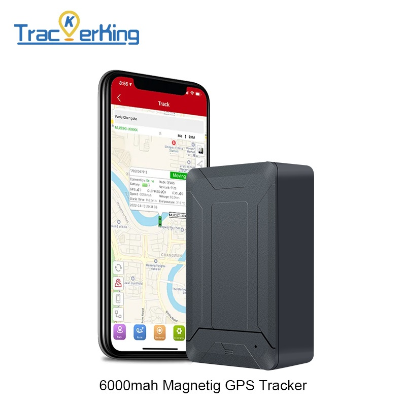

# TrackerKing - JX05

The TrackerKing JX05 is a portable 2G GPS tracker engineered for long standby operation and anti theft asset protection. Built as a no wiring solution with a strong magnetic housing and a large internal battery, the JX05 is intended for covert mounting on trailers, containers, construction equipment and other high value unattended assets where long autonomous life and discreet attachment are priorities.

As a device compatible with Plaspy, the JX05 forwards location and alarm data into Plaspy accounts or a custom backend using GT06 protocol with JT808 and Tianqin mapping options available. This makes the tracker relevant for operators who need rapid deployment, centralized monitoring and integration of movement, vibration, geofence and low battery alerts into an existing fleet visibility workflow in Plaspy.

## Key Highlights

- Long autonomous operation with a high capacity internal battery to reduce maintenance intervals and support extended standby deployment.
- No wiring required thanks to a strong magnetic housing for fast, covert attachment and easy redeployment across assets.
- Real time tracking and alarm reporting including movement, vibration, geofence and low battery alerts for timely event detection.
- Protocol flexibility with GT06 as the common default and JT808 or Tianqin mapping options to match backend requirements.
- Configurable power saving modes to extend battery life for long term asset monitoring.
- Suited to trailers, containers, parked vehicles and construction equipment where unattended assets need protection and visibility.

## How It Works with Plaspy

The JX05 integrates with Plaspy by sending standard tracker messages over 2G using GT06 protocol, with JT808 or Tianqin options available where chosen. Plaspy ingests those messages to provide live tracking, alarm routing and historical position data so operations teams can monitor assets and respond to alerts from a central platform.

- Real time location and telemetry updates streamed into Plaspy for live map views and tracking dashboards.
- Movement and vibration alarms forwarded to Plaspy alerting rules for rapid notification of possible theft or tampering.
- Geofence events and overspeed notifications available in Plaspy reports and event feeds.
- Low battery notifications surfaced to enable proactive maintenance scheduling in Plaspy workflows.
- Protocol mapping choices help ensure the JX05 can deliver position and event data into Plaspy or a compatible backend without extensive custom integration.

## Typical Use Cases

- Fleet asset tracking for trailers and non powered equipment that require long battery autonomy and periodic position reports.
- Anti theft protection for high value unattended assets using covert magnetic mounting and movement or vibration alerts.
- Construction site equipment monitoring to maintain visibility on tools and machinery left at remote locations.
- Container and yard monitoring where geofence alerts and low battery warnings support secure storage operations.
- Short term rentals and equipment sharing programs that need rapid redeployment without wiring work.

## Why Choose This Tracker with Plaspy

Pairing the JX05 with Plaspy offers a practical combination of autonomy, simplicity and backend compatibility. The large internal battery and configurable power saving modes reduce servicing frequency, while the magnetic mount simplifies installation and movement between assets. Protocol flexibility makes it easier for integrators to map messages into Plaspy or other tracking platforms with fewer changes to server side logic.

For organizations looking for a Plaspy compatible tracker focused on long standby, easy deployment and anti theft alerts, the JX05 provides a straightforward option that feeds actionable location and alarm data into centralized fleet workflows. To learn more about Plaspy and how compatible trackers integrate with our platform visit https://www.plaspy.com. Product specifications, availability, and manufacturer details can change over time, so verify current specifications and documentation with the manufacturer at https://trackerking.cn/.
