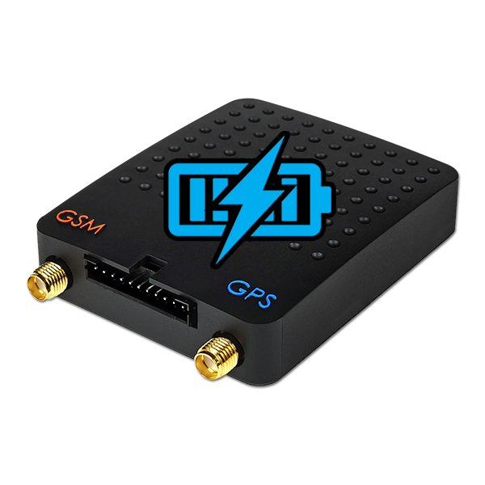

# Tytan SAT - DS520

The DS520 is a Plaspy compatible GPS tracker designed for reliable real time tracking of vehicles, cargo, and remote technical assets. As a GSM GPRS device it transmits GPS and GLONASS position, speed, and a range of telemetry and event parameters over UDP or TCP. The unit includes analogue and digital inputs, a 1 wire temperature interface, and digital outputs for remote circuit control, making it suitable for diverse monitoring and control tasks.

Because the DS520 integrates directly with Plaspy, organizations gain immediate visibility into location, status, and sensor data within a single fleet management platform. Non volatile memory provides store and forward capability so data recorded during network outages is retained and uploaded to Plaspy when connectivity returns. That combination supports continuous telemetry, historic event logging, and operational workflows such as routing, maintenance planning, alerts, and remote control actions.

## Key Highlights

- Plaspy compatible GPS tracker built for real time vehicle and asset tracking via UDP or TCP
- Dual constellation positioning with GPS and GLONASS for improved coverage
- Flexible telemetry with analogue and digital inputs and a 1 wire temperature interface
- Digital outputs for remote circuit control to support anti theft and remote actions
- Non volatile memory for store and forward recording during connectivity gaps
- Compact form factor suitable for vehicle, cargo, and technical object supervision

## How It Works with Plaspy

Integration is direct from device to platform the DS520 pushes positional and event data to Plaspy endpoints where those packets are ingested for live monitoring and analysis. Once in Plaspy the device data feeds maps, dashboards, alert rules, and historical reports so operators can act on location and status information from a single view.

- Real time location and speed updates displayed on Plaspy live maps
- Event and input monitoring mapped to Plaspy channels for ignition, doors, and other triggers
- Temperature readings from the 1 wire interface used to generate Plaspy alerts and thresholds
- Remote control actions initiated from Plaspy using device digital outputs where configured
- Buffered records stored in non volatile memory uploaded to Plaspy after network interruptions

## Typical Use Cases

- Fleet anti theft and remote immobilization workflows using ignition and output control
- Vehicle and cargo supervision with continuous position and speed reporting for routing and verification
- Temperature sensitive cargo monitoring with 1 wire sensors and alerting in Plaspy
- Remote equipment or technical object supervision where cellular coverage is available
- Historical reporting and event playback for incident review and operational analysis

## Why Choose This Tracker with Plaspy

The DS520 is a practical option for teams seeking a straightforward Plaspy compatible tracker with flexible inputs and outputs and reliable store and forward behaviour. Its support for GPS and GLONASS positioning plus GSM GPRS transmission enables consistent real time visibility, while the variety of interfaces allows integration of sensors and switches commonly used in fleet and asset workflows.

If you need centralized monitoring, configurable alerts, historical reports, and the ability to trigger remote actions from a single platform, the DS520 paired with Plaspy provides an operationally focused solution. Learn more about Plaspy on the main website https://www.plaspy.com. Product specifications, availability, and manufacturer details can change over time so please verify current specifications on the manufacturer's official website http://tytansat.com/.
