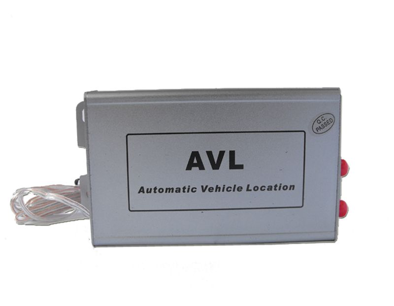

# TZone - AVL-05

The TZone AVL-05 GPS Vehicle Tracking device is a versatile and reliable solution for vehicle security, recovery, and fleet management. With its advanced features and user-friendly interface, it is suitable for a wide range of applications, including car, taxi, bus, and truck tracking.

One of the standout features of the AVL-05 is its ability to track vehicles both through software and cell phone. This allows users to easily monitor their vehicles' location and status from anywhere, providing peace of mind and real-time information. The device also offers various alarms, including over-speed, low power, and geo-fence alarms, ensuring that users are promptly notified of any potential issues or unauthorized activities.

In addition to tracking and alarms, the AVL-05 offers several other useful features. It has a roaming feature that helps save costs when the device is used in different regions. It also allows users to control or detect car doors and engine on/off remotely. In emergency situations, the device can gradually and safely cut off the engine power. With GPRS \(TCP/UDP\) and SMS support, the AVL-05 ensures reliable and efficient communication.

The AVL-05 comes with a range of special features that further enhance its functionality. It supports commands to the device via GPRS, allowing users to customize and control its behavior. It also provides an SMS link for Google Maps, making it easy to view the vehicle's location on a map. The device can send GPRS data to an IP or DNS, enabling seamless integration with other systems. It even has mileage calculation capabilities, making it ideal for fleet management and cost optimization.

With its 32Mb flash memory, the AVL-05 can store a significant amount of data, ensuring that no information is lost. It also offers fuel/oil level detection and optional temperature sensors, allowing for comprehensive monitoring of vehicle conditions. Additionally, the device is equipped with a microphone and listen-in function, enabling two-way conversation and enhanced communication.

The TZone AVL-05 GPS Vehicle Tracking device is a reliable and feature-rich solution for vehicle tracking and fleet management. Its advanced features, user-friendly interface, and special capabilities make it an excellent choice for businesses and individuals looking to enhance the security and efficiency of their vehicles.

