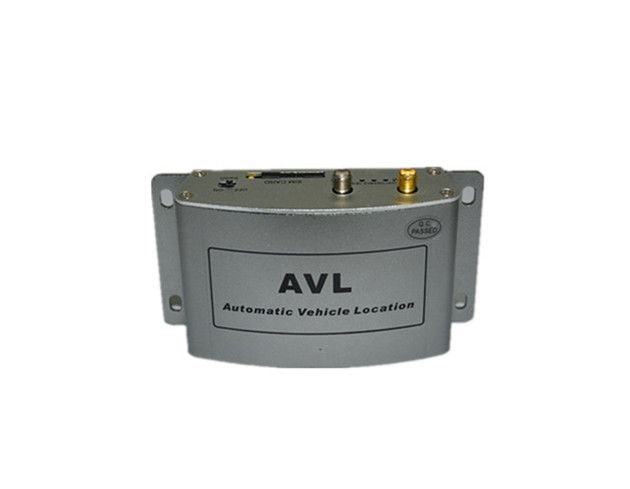

# TZone - TZ-AVL02

The TZone TZ-AVL02 is a compact GPS/GSM/GPRS tracking device built for real time vehicle tracking and security. It pairs a sensitive GPS module with GPRS communication to deliver stable location fixes even in challenging or remote areas. The unit is physically small and lightweight, measuring 108mm x 58mm x 28mm and weighing about 140g, and it includes exterior GSM and GPS antennas for improved reception.

As a Plaspy compatible tracker, the TZ-AVL02 can feed position and status data into Plaspy to provide continuous visibility for vehicles. Its wide exterior power range and inner battery backup help maintain connectivity during typical vehicle use and brief power interruptions, while status indicators and multiple I O ports support common tracking and alerting needs that Plaspy can surface for operations and reporting.

## Key Highlights

- Real time GPS tracking combined with GSM GPRS communication for remote reporting
- High sensitivity GPS chip and exterior antennas for improved reception and faster fixes
- Compact form factor and light weight for discreet placement in vehicles
- Wide DC power input range to support many vehicle types and a built in battery for standby operation
- LED indicators for signal and power status to aid diagnostics on site
- Multiple input and output ports including SOS button and digital and analog inputs for basic event signaling
- Designed to operate across a broad temperature range for varied climates

## How It Works with Plaspy

When connected to Plaspy, the TZ-AVL02 supplies location and device status data that Plaspy processes for mapping, monitoring, and reporting. Plaspy ingests the device feeds and presents them alongside other fleet assets to give operations teams centralized oversight and historical playback.

- Live location updates displayed on Plaspy maps for real time tracking and dispatch
- Event signaling such as SOS and digital inputs forwarded to Plaspy for alerting and incident response
- Status indicators and basic diagnostics available through Plaspy to aid operational decision making
- Historical route playback and reporting for trip review and compliance purposes
- Geofence and movement alerts configured in Plaspy to notify teams of route deviations or unauthorized use

## Typical Use Cases

- Fleet vehicle tracking for small and medium transport operations
- Logistics and delivery visibility to monitor routes and timeliness
- Vehicle security and recovery monitoring with SOS alert support
- Rental and shared vehicle oversight to track usage and location
- Individual high value vehicle tracking for added peace of mind

## Why Choose This Tracker with Plaspy

The TZ-AVL02 is a practical choice for organizations that need a straightforward, reliable vehicle tracker that works well in varied environments. Its emphasis on GPS sensitivity, external antennas, and a flexible power range make it suitable for many vehicle types, while the built in battery provides short term continuity if external power is lost.

Paired with Plaspy, the device becomes part of a unified fleet management view where location, events, and basic device status are consolidated for operations, reporting, and response. For teams seeking clear visibility without unnecessary complexity, the TZ-AVL02 and Plaspy combination offers an accessible path to live tracking and operational oversight.

To learn more about how Plaspy can manage devices like the TZ-AVL02 visit https://www.plaspy.com. Product specifications and availability can change over time, so please verify current details with the manufacturer documentation at http://www.tzonedigital.com/ before procurement.
