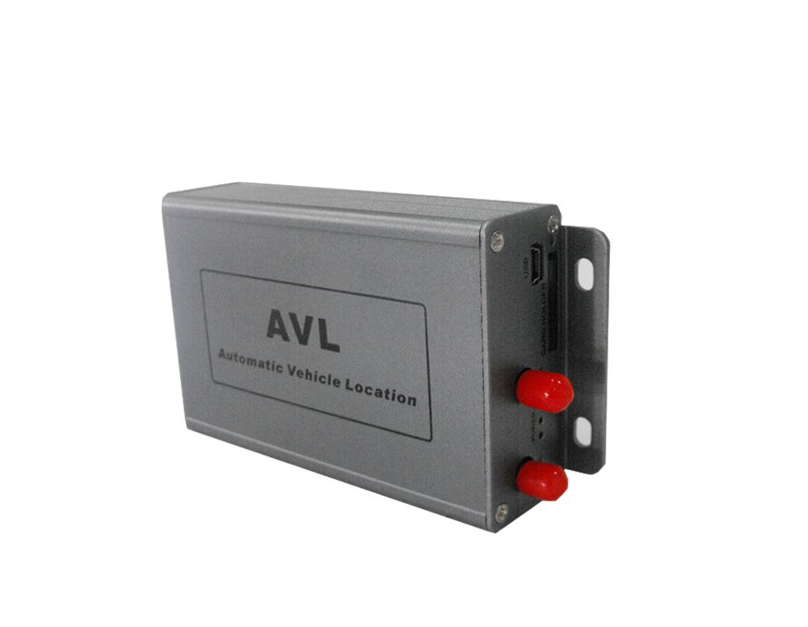

# TZone - TZ-AVL05

The TZone TZ-AVL05 is a compact and versatile GPS tracker designed for real-time vehicle location and status monitoring. It is presented as a solution suited to personal vehicles, fleet assets, and general asset tracking needs. The device includes practical monitoring features such as over-speed, low power, and geo-fence alarms, plus roaming capability to reduce costs when operating across regions.

As a Plaspy compatible device, the TZ-AVL05 can feed location and event data into the Plaspy platform so operators gain continuous visibility and operational oversight. Its support for GPRS and SMS communications, onboard data storage, backup power capability, and optional sensor inputs make it a flexible option that can be incorporated into Plaspy workflows for tracking, alerts, and reporting.

## Key Highlights

- Real time vehicle location monitoring for live visibility
- Over speed, low power, and geo fence alarm features for event notification
- GPRS and SMS communications with roaming support for flexible connectivity
- Up to 12 hours of backup battery operation for continued reporting during power loss
- 32 MB flash memory for local data logging and mileage calculation
- Support for fuel or oil level detection and optional temperature sensors plus built in microphone for two way audio

## How It Works with Plaspy

When paired with Plaspy, the TZ-AVL05 streams location and status updates that are displayed and managed through the Plaspy interface, enabling centralized monitoring and historical review. Plaspy processes device data and converts it into actionable insights, alerts, and reports for routine operations and exception handling.

- Live location tracking and map display for individual vehicles and entire fleets
- Geofence and over speed alerts routed to Plaspy so teams can respond quickly
- Historical route playback and mileage reporting using stored device data
- Remote command support from Plaspy to the device using supported communication channels
- Consolidated reporting and exportable activity logs for operational analysis

## Typical Use Cases

- Tracking and monitoring personal vehicles for safety and location awareness
- Fleet management for route oversight, dispatch support, and uptime monitoring
- Asset tracking for high value or mobile equipment that requires periodic location updates
- Overspeed and geofence enforcement to help manage driver behavior and route compliance
- Temperature or fuel monitoring where optional sensors are deployed to protect cargo or manage consumption

## Why Choose This Tracker with Plaspy

The TZ-AVL05 combines a focused set of tracking and alarm features with data storage and flexible communications, making it a practical option for organizations that need dependable vehicle visibility. Its backup battery and roaming support help maintain coverage across different operating regions, while optional sensor inputs expand its applicability beyond location alone.

Paired with Plaspy, this tracker provides a straightforward path to centralized monitoring, alerting, and reporting without excessive complexity. For precise specifications, firmware options, or to confirm current capabilities, please review the manufacturer documentation. To learn more about how Plaspy can work with the TZ-AVL05 and other compatible devices visit https://www.plaspy.com. Product specifications, availability, and manufacturer details can change over time, so verify current information with the official manufacturer documentation at http://www.tzonedigital.com/
