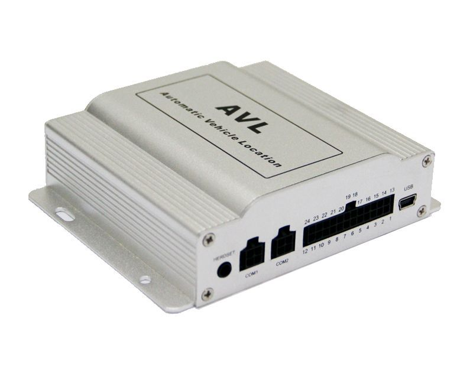

# TZone - TZ-AVL09

The TZone TZ-AVL09 GPS tracker is a versatile and reliable device that offers a range of features to help you track and monitor your vehicles. With support for single location and continual tracking, you can easily keep tabs on the whereabouts of your vehicles at all times. The tracker also comes with various alarm features, including over-speed alarm, low power alarm, geo-fence alarm, tremble alarm, parking alarm, and SOS alarm, ensuring that you are promptly notified of any potential issues or emergencies.

One of the standout features of the TZ-AVL09 is its ability to control car doors close/open and detect the status of the engine on/off. In case of an emergency, the device can even cut off the engine power gradually and safely. Additionally, the tracker supports GPRS \(TCP/UDP\) and SMS communication, allowing you to receive real-time updates and notifications on your mobile device or computer.

The TZ-AVL09 also offers several special features that enhance its functionality. It has an optional SD card slot for recording data, and it can connect to external RFID readers, cameras, and printers for added convenience. The device is equipped with a 3D accelerometer for accurate motion detection, and it supports sending GPRS data to IP or DNS. Other notable features include mileage calculation, 32Mb flash memory, fuel/oil level detection, temperature sensors \(optional\), two-way conversation, and mobile Google map integration. The tracker even supports ibutton for added security and convenience.

With its compact dimensions of 118mm x 93mm x 31mm and a weight of just 0.26KG, the TZ-AVL09 is easy to install and conceal. It operates on an external voltage range of 9V to 36V and comes with a backup battery of 850mAh/3.7V. The device has excellent GPS sensitivity of -163dBm and is equipped with exterior GSM and GPS antennas to ensure reliable signal reception. It has a power consumption of less than 100mA in active mode and can operate in temperatures ranging from -20℃ to +60℃.

In terms of connectivity, the TZ-AVL09 offers a range of interfaces, including 2 analog input ports, 6 digital input ports \(2 positive input, 4 negative input\), 3 digital output ports, 4 serial ports, and 1 mini USB port. The device also features 3 LEDs to indicate power, GSM signal, GPS signal, and trembling status, as well as a built-in microphone and speakers for two-way communication.

