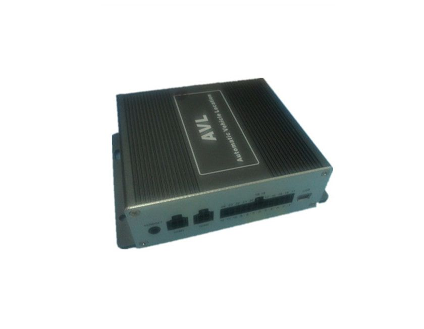

# TZone - TZ-AVL19

The TZone TZ-AVL19 is a vehicle GPS tracker designed for versatile fleet and vehicle monitoring. It provides single location and continual tracking so administrators can view current positions and movement history. The model includes a range of alarm options such as over-speed, low power, geo-fence, tremble, parking, and SOS to help identify potential issues or incidents promptly.

As a device compatible with Plaspy, the TZ-AVL19 can feed location and status data into Plaspy's fleet management platform to support visibility and operational oversight. Its support for GPRS and SMS communications, optional local recording, and features for remote vehicle control make it a practical candidate for organizations looking to integrate hardware with Plaspy for centralized tracking, alerts, and reporting.

## Key Highlights

- Supports single location and continual real time tracking for ongoing visibility
- Multiple alarm types including over speed, low power, geo fence, tremble, parking, and SOS
- Remote vehicle control and monitoring features such as door open close control and engine on off detection
- Communication via GPRS and SMS with optional local SD card recording
- Optional connections for external accessories and sensors including RFID reader and cameras
- Onboard features for mileage calculation, fuel level detection, and two way conversation

## How It Works with Plaspy

When integrated with Plaspy, the TZ-AVL19 supplies position and event data that Plaspy presents through its monitoring and reporting interfaces. Plaspy can consolidate incoming tracker data to provide a unified operational view across vehicles and sites, enabling actionable alerts and historical analysis.

- Display live location and recent track history in Plaspy for fleet situational awareness
- Receive and route alarms from the tracker such as geo fence breaches, SOS alerts, and over speed notifications
- Use mileage and event records in Plaspy reports for fleet utilization and operational planning
- Monitor engine status and door open close events within Plaspy dashboards for security and workflow checks
- Leverage stored data options such as SD card records where available to supplement server side logs

## Typical Use Cases

- Fleet management for small and medium commercial vehicle operations
- Rental or shared vehicle programs that need location and usage monitoring
- Security and asset protection for parked or unattended vehicles
- Logistics and delivery operations requiring location visibility and mileage reporting
- Service vehicle oversight including remote status alerts and incident notifications

## Why Choose This Tracker with Plaspy

The TZ-AVL19 combines a broad set of vehicle monitoring features with flexible communications, making it a practical option for organizations that require both live tracking and event driven alerts. Its ability to report door and engine status alongside alarms and mileage data aligns with common fleet management needs and can feed directly into Plaspy for consolidated oversight.

If you need a tracker that supports continual tracking, a variety of alarms, and optional accessory connections, the TZ-AVL19 is worth considering as part of a Plaspy-managed deployment. For more details about Plaspy services and platform capabilities, learn more on the Plaspy website https://www.plaspy.com. Product specifications, optional features, and availability can change over time, so verify current details with the manufacturer at http://www.tzonedigital.com/ before making purchasing or deployment decisions.
