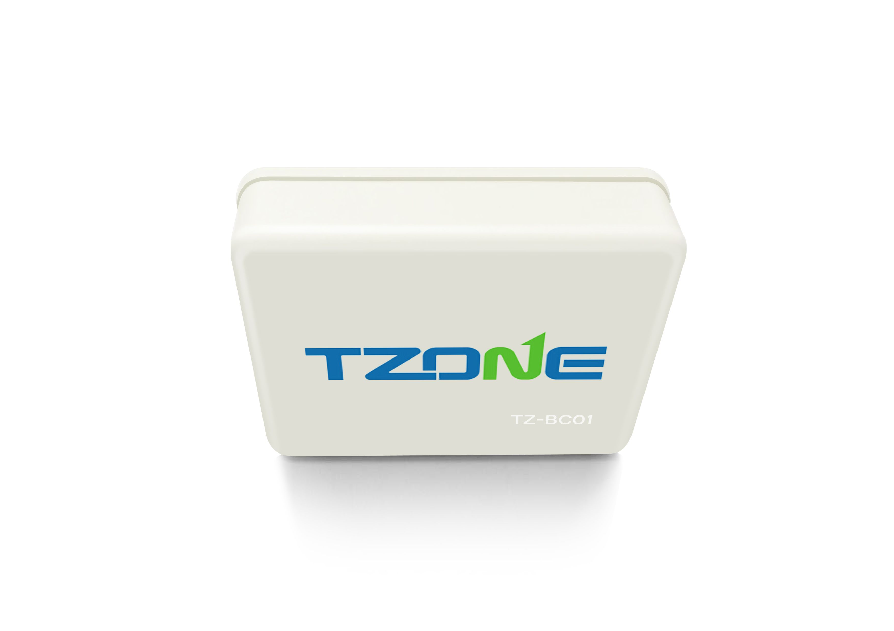

# TZone - TZ-BC01

The TZone TZ-BC01 is a compact and lightweight tracker designed to provide accurate and reliable location tracking in a discreet form factor. It measures approximately 50 x 35 x 15 mm and weighs about 30 grams, making it simple to attach or carry with personal items, equipment, or light vehicles. The unit uses the iPhone iBeacon protocol with Bluetooth 4.0 communication and supports both iOS 7.0 and above and Android 4.3 and above, offering broad device compatibility for proximity based monitoring.

As a Plaspy compatible device, the TZ-BC01 can be integrated into Plaspy workflows to provide presence, proximity, and location updates where Bluetooth connectivity and supported devices are available. Its adjustable broadcasting interval and transmit power, long working time from a CR2450 battery, and password protection make it suitable for scenarios where low maintenance and discreet tracking are important. Plaspy can surface the tracker's location and status within fleet and asset views alongside other compatible devices.

## Key Highlights

- Compact and lightweight form factor for discreet placement and easy handling
- Uses iPhone iBeacon protocol and Bluetooth 4.0 for device discovery and proximity updates
- Compatible with iOS 7.0 and above and Android 4.3 and above for wide device support
- Long working time from a CR2450 battery, suitable for extended deployments
- Adjustable broadcasting interval and transmit power to tune visibility and battery life
- Transmission range of approximately 50 to 80 meters in open field conditions
- Password protection to restrict access to the tracker settings and data

## How It Works with Plaspy

When used with Plaspy, the TZ-BC01 provides proximity and location signals that Plaspy can record and present alongside other tracking data. Plaspy treats compatible beacons as part of an overall monitoring strategy, giving operations teams the ability to view presence, recent activity, and location context within the Plaspy platform.

- Display proximity events and recent location appearances in Plaspy dashboards
- Group TZ-BC01 units with assets or personnel for consolidated monitoring
- Configure alerts in Plaspy for arrival, departure, or unexpected absence based on beacon signals
- Include TZ-BC01 activity in routine reports to track asset movement and uptime
- Use Plaspy views to correlate beacon presence with other device data for operational oversight

## Typical Use Cases

- Tracking small assets and personal belongings that benefit from a lightweight, discreet beacon
- Proximity monitoring for equipment or packages in storage and workplace environments
- Temporary tagging of items during short term operations where long battery life is useful
- Adding presence detection to workflows within a Plaspy managed fleet or asset list
- Security enhancement through password protected beacon access for restricted items

## Why Choose This Tracker with Plaspy

The TZ-BC01 is a practical option when you need a compact, easy to deploy tracker that emphasizes low maintenance and discreet operation. Its iBeacon based design and adjustable broadcast settings let organizations balance visibility and battery life, while compatibility with common mobile operating systems allows straightforward integration into existing device ecosystems.

Paired with Plaspy, the TZ-BC01 can extend presence and proximity awareness into fleet and asset management workflows, helping teams monitor small items or augment location context where GPS devices are not required or practical. For organizations seeking a simple, battery efficient tracker that can be shown and managed within Plaspy, the TZ-BC01 is a relevant choice.

To learn more about using compatible trackers with Plaspy visit https://www.plaspy.com. Product specifications, availability, and manufacturer details can change over time, so verify current technical information on the official manufacturer site http://www.tzonedigital.com/.
