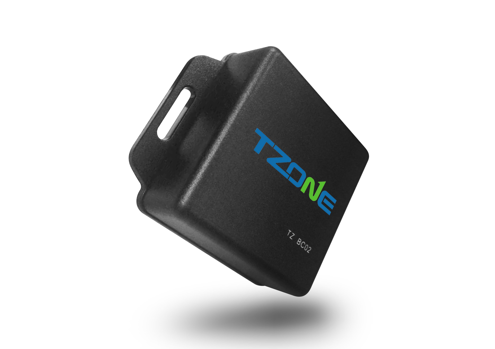

# TZone - TZ-BC02

The TZone TZ-BC02 is a compact and lightweight tracking device designed to provide reliable location and proximity monitoring for small assets and personal items. Measuring approximately 50 x 50 x 20 mm and weighing about 30 grams, the unit is easy to carry and conceal. It supports iPhone iBeacon protocol with Bluetooth 4.0 compatibility and also works with Android devices running Android 4.3 and above, offering broad smartphone interoperability for proximity based tracking.

As a Plaspy compatible device, the TZ-BC02 can be incorporated into Plaspy workflows for monitoring, grouping, and reporting on tracked items. Its small form factor and long expected battery life make it practical for ongoing asset oversight, and adjustable transmit settings and broadcast intervals allow for flexible use patterns that Plaspy can surface in dashboards and alerts.

## Key Highlights

- Compact and lightweight design suitable for discreet placement on small assets
- Compatible with iPhone iBeacon protocol and Android devices running Android 4.3 and above
- Long battery life with an expected working time of roughly 1.5 to 2.5 years depending on mode
- Adjustable broadcasting interval with a default of 500 ms for flexible reporting behavior
- Transmit power can be adjusted to suit proximity needs and preserve battery life
- Transmission distance of approximately 50 to 80 meters in an open field for short range coverage

## How It Works with Plaspy

When used with Plaspy, the TZ-BC02 provides proximity and location signals that can be recorded and managed inside the Plaspy platform to improve visibility and operational oversight. Plaspy can group TZ-BC02 devices with other assets, trigger notifications, and include beacon events in historical reporting to support audits and asset lifecycle tracking.

- Display proximity events and last known location on Plaspy maps and asset lists
- Create alerts and notifications for presence or absence based on beacon transmissions
- Include TZ-BC02 devices in asset groups and tags for organized monitoring and reporting
- Track historical movement and generate time based reports for operational review
- Use Plaspy dashboards to monitor fleet or asset pools that include TZ-BC02 devices
- Integrate beacon activity into routine audits and inventory checks managed in Plaspy

## Typical Use Cases

- Keeping track of personal belongings such as bags and luggage during travel
- Monitoring small equipment and tools in warehouses or worksites
- Proximity based checks for pets or children in limited range environments
- Attaching to high value items for short range location and presence monitoring
- Supplementary tracking for trailers or cargo compartments where short range beacons are appropriate

## Why Choose This Tracker with Plaspy

The TZ-BC02 is a practical choice for organizations and individuals who need discreet, battery efficient tracking for small assets and personal items. Its compatibility with common smartphone platforms and iBeacon protocol makes it well suited to proximity monitoring scenarios, while adjustable transmit settings help balance visibility and battery life. When connected to Plaspy, the device becomes part of a unified monitoring environment where beacon events and item groupings contribute to clearer operational oversight.

Because the TZ-BC02 focuses on compactness and long battery life rather than broad range continuous telematics, it is most useful where short range detection and periodic reporting meet your operational needs. Plaspy will help surface the device data alongside other trackers and assets so teams can manage mixed fleets and item inventories from a single platform.

To learn more about using Plaspy with compatible trackers visit https://www.plaspy.com. Product specifications and availability can change over time, so please verify current technical details and manufacturer information at http://www.tzonedigital.com/.
