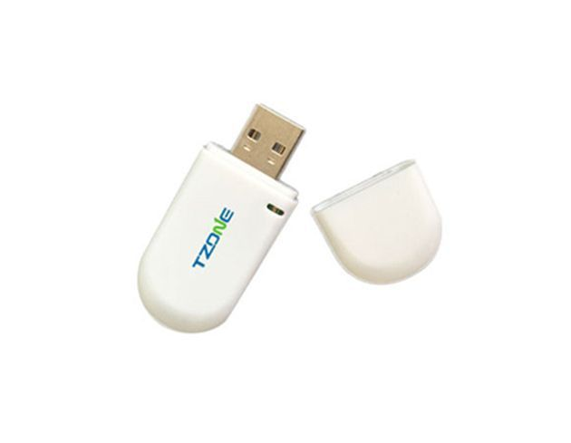

# TZone - TZ-BC06

The TZone TZ-BC06 is a compact and lightweight tracker designed to provide accurate and reliable short range location and presence detection. With a creamy white finish and a slim form factor measuring approximately 60 x 24 x 9 mm and weighing about 15 grams, the TZ-BC06 is easy to carry or attach to personal items and equipment. It uses the iPhone iBeacon protocol over Bluetooth 4.0 to broadcast signals at configurable intervals and transmit power levels, allowing adjustment for performance and range.

As a Plaspy compatible device, the TZ-BC06 can extend Plaspy visibility to short range and proximity use cases where beacon style detection is useful. Plaspy can record and display beacon events and presence changes reported by compatible receivers, letting teams track items, monitor access points, and integrate proximity data into broader operational workflows. This makes the TZ-BC06 a practical addition to Plaspy deployments that need close range location awareness alongside other tracking devices.

## Key Highlights

- Compact and lightweight design ideal for attaching to small items or carrying on person
- Uses iPhone iBeacon protocol for beacon style presence broadcasts
- Bluetooth 4.0 based communication for compatibility with a wide range of devices
- Adjustable broadcasting interval and transmitted power for tuning performance
- Works with iOS 7.0 and above and Android 4.3 and above
- Supports password protected connections and offers transmission distance up to 50 to 80 meters in open field conditions

## How It Works with Plaspy

The TZ-BC06 broadcasts beacon signals that can be observed by compatible devices and gateways tied into Plaspy. Once detected, those events can be captured by Plaspy to provide presence information, short range location markers, and time stamped records that feed into monitoring and reporting workflows.

- Record proximity events and presence changes in Plaspy dashboards for asset and personnel visibility
- Use signal detections to trigger alerts or notifications when an item enters or leaves a monitored area
- Aggregate beacon detections into timeline views and reports for operational oversight
- Combine TZ-BC06 proximity data with other Plaspy device data to enrich situational awareness
- Apply adjustable broadcast settings to balance detection range and update frequency within Plaspy workflows

## Typical Use Cases

- Tracking small assets and tools within a facility or yard
- Monitoring presence of personal belongings such as bags or keys
- Proximity based workflows for equipment check in and check out
- Short range location points for warehouse zones, gates, or entrances
- Adding beacon based markers to mixed device fleets for richer location context

## Why Choose This Tracker with Plaspy

The TZ-BC06 is a sensible choice for organizations that need compact, easily deployable proximity tracking integrated into a larger tracking platform. Its small footprint and configurable broadcast behavior make it adaptable for use on personal items, equipment, or as location beacons inside buildings and outdoor sites. When used with Plaspy, the TZ-BC06 adds short range presence detection that complements longer range tracking devices, helping teams gain more granular visibility where it matters.

Because the TZ-BC06 relies on iBeacon style broadcasts, it is best suited to proximity and short range use cases rather than long distance positioning on its own. For teams looking to combine different tracking technologies, Plaspy can ingest beacon events alongside other device data to provide a unified view of assets and operations.

To learn more about how Plaspy can work with compatible devices like the TZone TZ-BC06, visit https://www.plaspy.com. Product specifications, availability, and manufacturer details can change over time, so please verify current specifications and documentation with the manufacturer at http://www.tzonedigital.com/.
