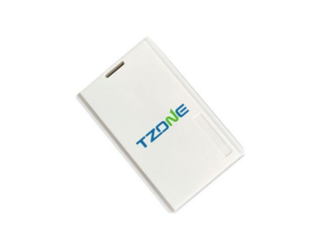

# TZone - TZ-BT07

The TZone TZ-BT07 is a compact and lightweight GPS tracker designed to provide accurate and reliable tracking capabilities. With its creamy white color and dimensions of 86\*55\*55 mm, it is both stylish and portable, making it easy to carry and conceal. Weighing only 40 grams, it is lightweight and won't add unnecessary bulk to your belongings.

This GPS tracker utilizes the iPhone iBeacon protocol, which is a Bluetooth 4.0 technique, ensuring seamless and efficient connectivity. It is compatible with iOS 7.0 and above, as well as Android 4.3 and above, making it suitable for a wide range of devices. The TZone TZ-BT07 also supports password protection for added security, ensuring that only authorized individuals can access the tracker.

With a transmission distance of 50-145 meters in an open field, this GPS tracker offers a reliable and extensive range. It has a working time of 3 years, thanks to its CR 3032 battery, providing long-lasting performance without the need for frequent recharging. The broadcasting interval is adjustable, ranging from 0.1 to 3 seconds, allowing you to customize the frequency of updates according to your needs. The transmitted power is also adjustable, ranging from -30 to 4 dBm, providing flexibility in signal strength.

Overall, the TZone TZ-BT07 is a versatile and reliable GPS tracker that offers accurate tracking capabilities in a compact and lightweight design. Whether you need to track your personal belongings or keep an eye on your loved ones, this GPS tracker is a reliable choice.

