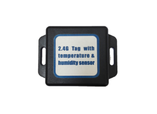

# TZone - TZ-Tag04

The TZone TZ-Tag04 is a versatile GPS tracker that offers a range of features to help you keep track of your belongings. With its RFID 2.4 G wireless communication, you can easily monitor the location of your items in real-time. The precision sensor built-in ensures accurate tracking, while the temperature and humidity detection feature allows you to monitor the environmental conditions of your belongings. 

This GPS tracker is equipped with a 3V built-in battery, providing long-lasting power for extended use. The TZ-Tag04 is designed with durability in mind, with an IP65 rating for water and dust resistance. Its compact and lightweight design, measuring 67mm\*51mm\*15mm and weighing only 25g, makes it easy to attach to various objects without adding bulk or weight. 

With a maximum transmission distance of 30 meters, adjustable sending time intervals, and adjustable TX power, you have full control over the tracking parameters to suit your specific needs. The TZ-Tag04 has an operating life of up to 3 years, ensuring reliable and long-term tracking. 

In terms of accuracy, this GPS tracker boasts a temperature accuracy of ±0.3℃ and a humidity accuracy of ±3.0%RH, providing precise environmental monitoring. The low power alarm feature alerts you when the battery is running low, ensuring that you never lose track of your belongings. 

Whether you need to track valuable assets, monitor temperature-sensitive items, or keep an eye on the conditions of your belongings, the TZone TZ-Tag04 is a reliable and feature-packed GPS tracker that delivers exceptional performance.

