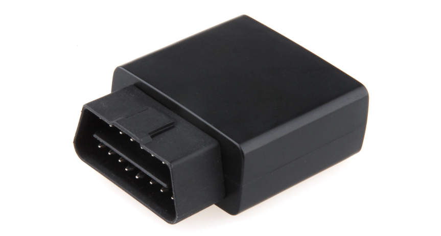

# Ulbotech - L101

The Ulbotech L101 is a compact plug and play OBDII GPS data logger designed for straightforward vehicle telemetry. It combines a high sensitivity GNSS module, an OBDII interface that supports common vehicle protocols, Bluetooth 4.0 Low Energy, and a 3 axis accelerometer in an OBDII form factor. Onboard storage and simple data export options make the L101 suitable for continuous location logging and longer term data capture without requiring complex wiring.

As a Plaspy compatible device, the L101 can feed position and vehicle telemetry into Plaspy for real time tracking, alerts, and historical reporting. Its OBDII telemetry, event detection, and immobilizer output allow Plaspy users to combine location visibility with vehicle diagnostics and driver behavior insights, enabling fleet and asset workflows from a single monitoring platform.

## Key Highlights

- Plug and play OBDII installation for fast deployment across fleets and rental vehicles
- High sensitivity GNSS module for accurate position fixes and reliable tracking
- Comprehensive OBDII telemetry support for engine and fuel related parameters
- Built in Bluetooth Low Energy for mobile live monitoring and accessory pairing
- Driver behavior detection and configurable geo fences for safety and compliance
- Onboard microSD and USB export options for offline data access and auditing
- Immobilizer output and alarm generation to support anti theft workflows

## How It Works with Plaspy

When connected into a Plaspy deployment, the L101 supplies continuous location and vehicle telemetry that Plaspy normalizes for dashboards, alerts, and reports. Plaspy ingests position updates and OBDII parameters to deliver visibility across vehicles and to trigger operational workflows based on telemetry and events.

- Real time location updates and historical route replay available in Plaspy dashboards
- OBDII telemetry fed into Plaspy for fuel monitoring, basic diagnostics, and status reporting
- Driver behavior and accelerometer events used by Plaspy to flag harsh driving, sudden maneuvers, and other safety events
- Immobilizer output and ignition related signals incorporated into anti theft and incident response workflows
- BLE enabled mobile monitoring can be used to forward data or assist with field diagnostics when paired with compatible devices

## Typical Use Cases

- Fleet management with continuous tracking, route analysis, and telemetry based reporting
- Rental and car sharing services requiring plug and play vehicle profiling and mileage auditing
- Anti theft and immobilization workflows using alarms and the immobilizer output
- Driver coaching and insurance telematics driven by event detection and behavior reports
- Roadside assistance and preliminary diagnostics through captured OBDII codes and voltage status

## Why Choose This Tracker with Plaspy

The Ulbotech L101 is a practical option for organizations that need rich vehicle telemetry without complex installation. Its OBDII centric design delivers engine and fuel related data that enhances Plaspy reporting and operational oversight, while onboard logging and USB export provide straightforward options for audits or offline analysis. BLE support further enables convenient mobile monitoring and accessory integration when field access is needed.

If you want to learn more about how this tracker can fit into your Plaspy deployment, visit the Plaspy website https://www.plaspy.com to explore platform capabilities and integration options. Product specifications and manufacturer details can change over time, so please verify current specifications and availability with the manufacturer at http://www.ulbotech.com/.
