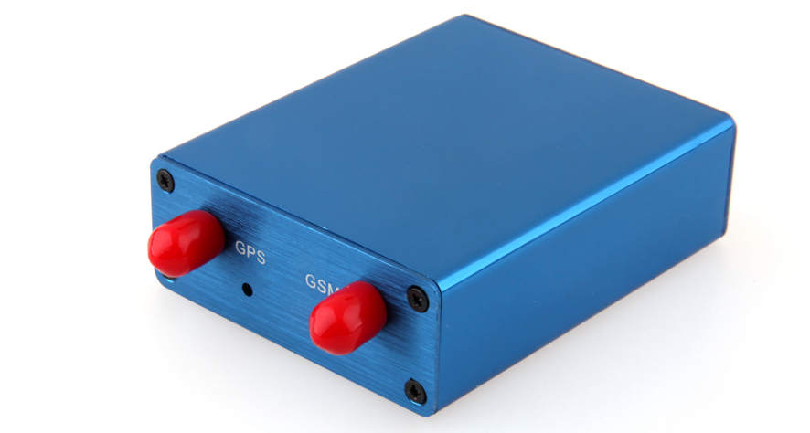

# Ulbotech - T303

The T303 is a professional grade vehicle GPS tracker purpose built for fleet management, anti theft protection and driver behaviour monitoring. Based on a proven platform and equipped with a high sensitivity GNSS module, quad band cellular connectivity and a comprehensive set of inputs and outputs, the T303 provides reliable real time location and telemetry for vehicles of many sizes. Configurable geo fences, emergency alert handling and remote immobilization support common telematics workflows.

As a Plaspy compatible device out of the box, the T303 can feed live positions, alerts and sensor data directly into Plaspy dashboards and reporting. That compatibility makes the T303 suitable for organisations that want centralized visibility, automated notifications and operational reports without custom integration work. When combined with Plaspy, the device contributes to streamlined fleet monitoring, theft response and driver profiling.

## Key Highlights

- Plaspy compatible for straightforward integration into real time tracking and fleet management dashboards.
- High sensitivity GNSS positioning with typical sub 3 meter accuracy in open sky conditions.
- Quad band cellular connectivity with GPRS for wide area telemetry and consistent data delivery.
- Internal immobilizer and a digital engine control output to support remote immobilization and anti theft processes.
- Built in accelerometer and multiple driver behaviour detections to support safety monitoring and driver scoring.
- Analog input and vehicle battery monitoring for simple fuel or telemetry integration.
- Firmware update over the air support to reduce onsite maintenance and keep devices current.

## How It Works with Plaspy

The T303 streams GNSS fixes and vehicle telemetry to Plaspy where the platform ingests the data, applies rules and surfaces live location, alerts and historical reports. Plaspy interprets standard events from the T303 so fleet managers can see trips, respond to emergencies and generate operational insights without complex setup.

- Real time location and history playback for live maps and audit trails in Plaspy
- Ignition detection and trip segmentation to produce usage and mileage reports
- SOS and emergency alerts routed to Plaspy for rapid notification and response
- Remote immobilizer control via the device output managed through Plaspy workflows
- Analog sensor telemetry for fuel and temperature dashboards within Plaspy
- Driver behaviour events and accelerometer readings feeding safety and compliance reports

## Typical Use Cases

- Fleet anti theft monitoring and remote immobilization for stolen vehicle response
- Driver behaviour analysis to reduce risk and improve training programs
- Fuel and telemetry monitoring for operational cost control and diagnostics
- Emergency response and roadside assistance using SOS alerts and live location
- Route verification, compliance reporting and vehicle utilization studies

## Why Choose This Tracker with Plaspy

The T303 is well suited to organisations that need a reliable, professional telematics device paired with a capable fleet platform. Its combination of sensitive GNSS positioning, broad cellular support, flexible inputs and built in safety features makes it a practical choice for fleets that require real time visibility, configurable alarms and remote control capabilities. Plaspy brings those device outputs into a centralized view for monitoring, alerts and reporting.

If you want a dependable tracker that integrates with a modern fleet management platform, the T303 and Plaspy provide a complementary solution for tracking, anti theft workflows and telemetry driven operations. Learn more about Plaspy on the main website https://www.plaspy.com and note that product specifications, features and availability can change over time so please verify current specifications and manufacturer details on the official Ulbotech site http://www.ulbotech.com/ before purchase.
