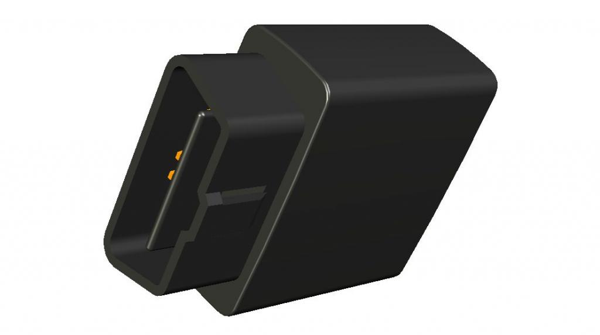

# Ulbotech - T356

The T356 is a Plaspy compatible GPS tracker engineered for vehicles that need reliable, cost-efficient telemetry and secure anti‑theft controls. Designed as an OBD‑II plug‑in unit with built‑in Wi‑Fi and generous local storage, the T356 enables near‑real‑time tracking via Plaspy when a Wi‑Fi connection is available and seamless data offload with zero per‑use cellular cost. Its compact package and broad protocol support make it suitable for light and heavy vehicles, fleet management, rental and insurance fleets, and vehicle safety programs.

The T356 combines a u‑blox NEO‑6M GNSS receiver \(with A‑GPS\) and full OBD‑II protocol support to deliver accurate GPS positioning and in‑vehicle telemetry to Plaspy. With a large internal flash able to store roughly two weeks of records, configurable Wi‑Fi profiles for automated offload, internal immobilizer and engine‑cut output for anti‑theft control, and optional Bluetooth sensors, the T356 is built to reduce operating costs while providing the telemetry, ignition and immobilizer signals modern fleet and safety applications require.

## Key Highlights

- Plaspy compatible Wi‑Fi GPS tracker that enables cost‑free \(0 use‑cost\) data upload when in range of configured networks.
- Large internal flash memory storing ~22,000 records \(~two weeks of tracking\) for robust offline operation and later data offload.
- Full OBD‑II support \(J1850 PWM/VPW, ISO9141‑2, ISO14230/KWP2000, ISO15765‑4 CAN\) plus SAE J1939/J1708/J1587 for heavy vehicle telemetry.
- Built‑in immobilizer and engine‑cut digital output for remote anti‑theft control and immobilization via Plaspy commands.
- Internal 3‑axis accelerometer to detect and report up to eight configurable poor driving behaviors for driver profiling and safety programs.
- Wi‑Fi \(802.11 b/g/n\) station & soft‑AP modes with WPA/WPA2/WPS and support for >1,600 access point profiles for automated data offload.
- Low power design \(70 mA active, 10 mA sleep\) and broad operating voltage \(8–32 V DC\) for continuous vehicle operation.

## How It Works with Plaspy

The T356 integrates with Plaspy to deliver location, vehicle telemetry and event information through Wi‑Fi offloads and live network uploads. While the device stores data locally during trips, it automatically uploads stored records to Plaspy when it detects a configured Wi‑Fi access point \(for example, at refueling stations, depots or parking locations\). When connected, Plaspy receives near‑real‑time tracking and telemetry for fleet management dashboards, alerts and reporting.

- Real‑time location and telemetry updates \(when connected via Wi‑Fi\) for routing and fleet management.
- Ignition \(ACC\) and digital input status reporting for trip start/stop, SOS events and wired alarms.
- On‑board OBD and J1939 telemetry such as engine parameters and common fuel/diagnostic data where available from the vehicle bus.
- Remote immobilizer and engine‑cut control to support anti‑theft workflows and remote vehicle disable via Plaspy commands.
- Optional Bluetooth sensors support \(BLE\) for accessory sensors or beacons when deployed and configured.

## Technical Overview

| Model | T356 |
| --- | --- |
| Connectivity | Wi‑Fi 802.11 b/g/n \(station & soft‑AP\); optional Bluetooth 4.0 BLE; micro USB for configuration and debugging |
| Bands / Networking | Wi‑Fi only \(no cellular\); supports WPA/WPA2/WPS; configurable Wi‑Fi profile list >1,600 APs |
| GNSS | u‑blox NEO‑6M with A‑GPS; position accuracy &lt;3 m \(open sky\), SBAS 2.0 m; tracking sensitivity −162 dBm |
| OBD & Vehicle Protocols | Full OBD‑II protocols: J1850 PWM/VPW, ISO9141‑2, ISO14230/KWP2000, ISO15765‑4 CAN; SAE J1939/J1708/J1587 for heavy vehicles |
| Memory & Storage | Internal flash ~22,000 records \(about two weeks\); configurable geo‑fences \(circular, rectangular, polygon up to 32 points\) |
| Power & Battery | Operating voltage 8–32 V DC; internal Li‑Polymer backup battery 3.7 V, 180 mAh; low power modes: 70 mA active, 10 mA sleep |
| Inputs & Outputs | Engine‑cut digital output; internal immobilizer; configurable inputs for ACC, SOS, and analog sensors |
| Sensors | Internal 3‑axis accelerometer for driver behaviour monitoring \(up to 8 event types\) |
| Antennas & Sensitivity | Internal GPS and Wi‑Fi antennas; Wi‑Fi sensitivity −98 dBm; GPS sensitivity −162 dBm tracking |
| Firmware & Management | FOTA via Wi‑Fi; micro USB for firmware update and debugging |
| Form Factor | Compact OBD‑II plug package, 50 × 50 × 23 mm, approx. 50 g |

## Use Cases

- Fleet management: cost‑effective telemetry and routing data collection with centralized Plaspy dashboards.
- Anti‑theft and immobilization: remote engine‑cut and immobilizer control for stolen vehicle recovery and security workflows.
- Driver behavior and insurance telematics: accelerometer‑based event detection and OBD‑based driving profiles for safety and risk scoring.
- Rental and vehicle profiling: automated offload at depots and Wi‑Fi‑based uploads for usage reports and billing reconciliation.
- Roadside assistance and diagnostics: OBD and J1939 telemetry to surface engine parameters and fault codes where available.

## Why Choose This Tracker with Plaspy

Choosing the T356 as a Plaspy compatible GPS tracker provides a practical balance of low operating cost, robust offline capability and vehicle‑grade telemetry. Its Wi‑Fi first approach eliminates ongoing cellular data fees when frequent depot or parking offload is possible, while the large internal flash prevents data loss between uploads. Full OBD‑II and heavy‑vehicle protocol support give fleets and service providers the telemetry needed for fuel monitoring, diagnostics and vehicle profiling where vehicle buses expose that data. Built‑in immobilizer and engine‑cut outputs, plus configurable ignition \(ACC\) and SOS inputs, allow Plaspy to combine location, event alerts and remote control for anti‑theft and operational workflows.

In short, T356 is a compact, Plaspy compatible GPS tracker that fits fleet management, insurance telematics and security applications that prioritize cost control, rich vehicle data and dependable off‑network storage. Its configurable Wi‑Fi profiles, FOTA capability and optional BLE support make deployment and long‑term management straightforward for organizations scaling their tracking and telemetry solutions.

