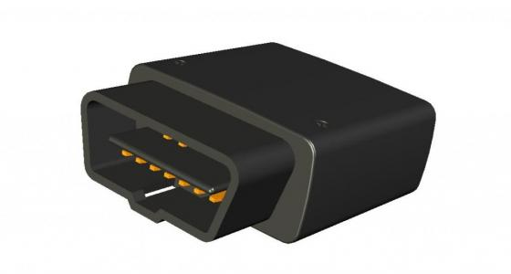

# Ulbotech - T363

The Ulbotech T381 is an advanced OBDII GPS tracker that combines 4G network and WIFI technology to provide a range of powerful features. With its integrated 4G LTE and WIFI capabilities, the T381 can transfer the 4G signal of a mobile operator to WIFI signal, effectively creating a WIFI hotspot. This allows up to 10 smartphones, tablets, and laptops to connect to the internet via WIFI, enabling high-speed sharing of resources and seamless communication between devices within the local area. Additionally, the T381 supports WIFI bridging, allowing it to connect to surrounding WIFI hotspots and access the internet, saving 4G data consumption.

The T381 is equipped with an internal u-blox MAX-7 GNSS module, which supports both GPS and GLONASS positioning systems. With its high-gain active antenna and Assist Now AGPS function, the T381 ensures fast and accurate positioning, even when installed in hidden or hard-to-reach areas of a vehicle. Furthermore, the T381 features On-board Diagnostics \(OBDII\)/SAE J1939 functionality, allowing it to obtain real-time on-board data such as RPM, speed, engine coolant temperature, fuel level, and fuel consumption. It also provides in-time monitoring of Diagnostic Trouble Codes \(DTC\), OBD II parameters, and alarms.

In addition to its GPS tracking and OBDII capabilities, the T381 is equipped with a 3D acceleration sensor, enabling real-time detection of motion and analysis of eight different driving behaviors. This allows for effective analysis of driver behavior and fuel consumption, providing valuable insights and improvement suggestions. The T381 also features an immobilizer \(engine cut off\) output, making it suitable for a wide range of applications including fleet management, insurance and rental services, roadside assistance, driver behavior monitoring, and safety and security.

#### Key Features:

- Integrated 4G LTE and WIFI technology for WIFI hotspot functionality
- Supports up to 10 devices to connect to the internet via WIFI
- WIFI bridging function for accessing the internet through surrounding WIFI hotspots
- Internal u-blox MAX-7 GNSS module for GPS and GLONASS positioning
- High-gain active antenna and Assist Now AGPS function for fast and accurate positioning
- On-board Diagnostics \(OBDII\)/SAE J1939 function for real-time vehicle data
- 3D acceleration sensor for real-time detection of motion and analysis of driving behavior
- Immobilizer \(engine cut off\) output for anti-theft functionality

