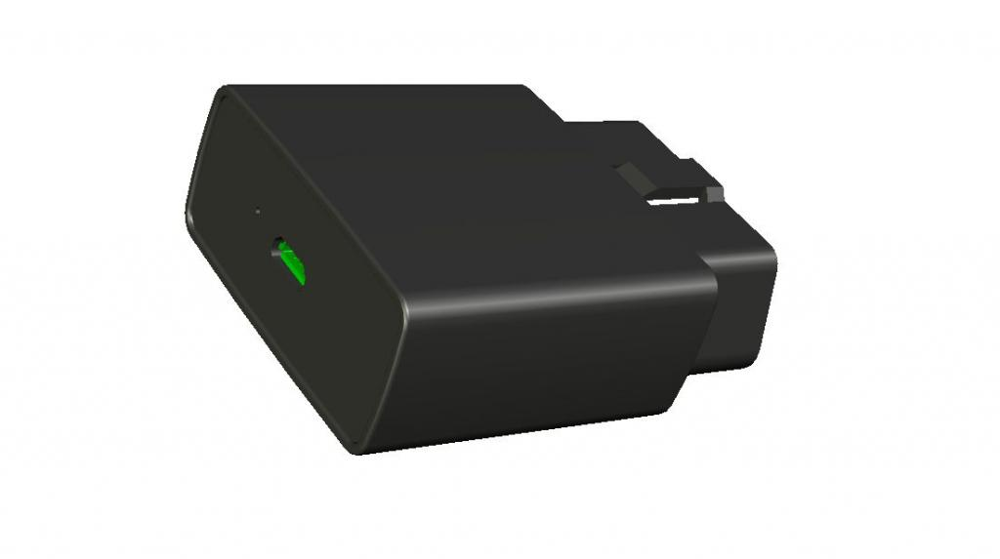

# Ulbotech - T370

The Ulbotech T370 is a compact OBD GPS tracker designed for reliable real time vehicle tracking, theft protection and driver behavior monitoring. Built to plug into a vehicle OBD port for fast deployment, the device combines a u‑blox MAX‑7 GNSS receiver and Telit xE910 family cellular connectivity to provide positioning and telemetry suited to fleet and telematics applications. Its internal accelerometer, immobilizer output and onboard backup battery make the T370 a practical choice for operators seeking a turnkey OBD solution.

As a Plaspy compatible device, the T370 feeds location, movement and OBD sourced vehicle data directly into Plaspy dashboards, alerts and reports. That compatibility means fleet managers, rental operators and insurance telematics providers can use the T370 within Plaspy workflows for monitoring, event detection and remote interventions without complex integration work.

## Key Highlights

- Plug and play OBD form factor for rapid deployment across vehicles.
- u‑blox MAX‑7 GNSS for fast position fixes and consistent tracking.
- Telit xE910 family cellular modem for broad cellular coverage options.
- Internal 3 axis accelerometer for movement and driver behavior events.
- Built in immobilizer digital output to support anti theft workflows.
- FOTA capable modem to allow remote firmware maintenance.
- Compact design with onboard backup battery for short power interruptions.

## How It Works with Plaspy

When paired with Plaspy, the T370 streams GNSS fixes, accelerometer events and available OBD parameters into Plaspy so teams can monitor location and vehicle status in real time. Plaspy ingests the tracker data to power geofence alerts, driver scoring, route playback and operational reporting while offering centralized device status and remote management visibility.

- Real time location updates and route playback for fleet visibility.
- Geofence alerts and entry exit notifications fed into Plaspy rules.
- Accelerometer based events used for driver behavior monitoring and scoring.
- OBD sourced parameters visible in Plaspy reports when available from the vehicle.
- Remote immobilizer control and device status reporting used in coordinated Plaspy workflows.

## Typical Use Cases

- Fleet management for route tracking, utilization and dispatch oversight.
- Vehicle anti theft programs using alerts and immobilizer control.
- Insurance telematics and driver profiling for risk assessment.
- Rental and shared mobility services requiring quick device turnover and centralized monitoring.
- Roadside assistance and rapid location reporting for operational response.

## Why Choose This Tracker with Plaspy

The T370 is well suited to organizations that need a compact, easy to deploy tracker that integrates into a fleet platform like Plaspy. Its OBD interface reduces installation overhead, while the combination of GNSS positioning, accelerometer events and an immobilizer output supports common telematics and security workflows without additional hardware complexity.

To learn more about how the T370 works with Plaspy and whether it fits your deployment, visit https://www.plaspy.com. Product specifications and availability can change over time, so please verify current device details on the manufacturer website http://www.ulbotech.com/.
