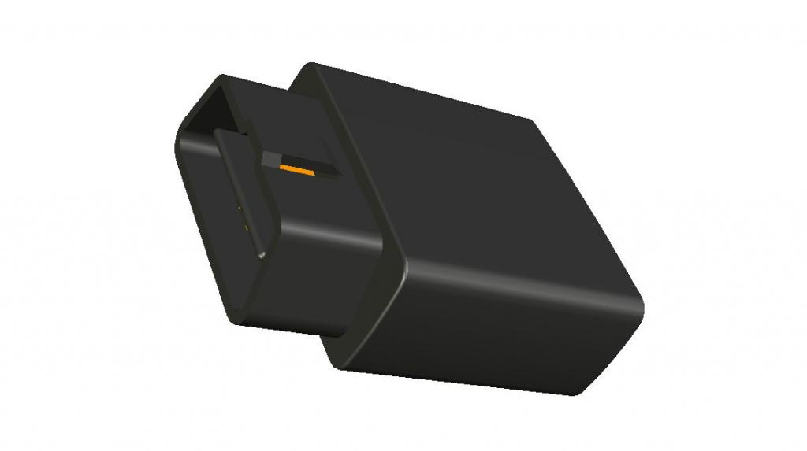

# Ulbotech - T373B

The T373B is a Plaspy compatible OBD II GPS tracker engineered for plug-and-play vehicle monitoring. Designed around a Telit xE910 cellular modem and a u-blox MAX-7 GNSS module, the T373B delivers reliable real-time tracking, telemetry and driver behaviour data over GSM/WCDMA networks while offering Bluetooth 4.0 LE for local device extension and configuration.

The compact T373B connects directly to the vehicle OBD II port to provide fleet management, anti-theft and fuel monitoring capabilities without complex installation. With built-in diagnostics \(OBDII, SAE J1939, J1708/J1587\), DTC alerts, an immobilizer digital output and support for firmware over-the-air updates, this Plaspy compatible tracker is ready for deployments that require accurate positioning, rapid time-to-first-fix and rich vehicle telemetry.

## Key Highlights

- Plaspy compatible plug-and-play OBD II GPS tracker for fast fleet management deployment.
- Real-time tracking using u-blox MAX-7 \(GPS + GLONASS\) with AssistNow A-GPS for fast TTFF in hidden installations.
- Telit xE910 cellular modem supporting broad GSM/WCDMA/4G-capable bands for dependable connectivity.
- Comprehensive vehicle telemetry: RPM, speed, ECT, fuel level and fuel consumption via OBDII and CANBUS.
- Internal 3-axis accelerometer and eight driving-behavior events for driver behaviour analysis and fuel monitoring.
- Anti-theft immobilizer \(engine cut\) digital output plus real-time DTC monitoring and alarms.
- Bluetooth 4.0 LE for mobile device pairing, feature extension and easy configuration.
- FOTA support via GPRS/WCDMA and micro USB for secure remote firmware management.

## How It Works with Plaspy

When integrated with Plaspy, the T373B streams vehicle location, on-board diagnostics and event-driven alerts so fleet managers and operators receive actionable telemetry and real-time tracking. Plaspy leverages the tracker’s GPS/GLONASS positions, trip profiles, DTC status and immobilizer control to deliver a full-stack fleet management experience—visibility, safety and remote control from a single dashboard.

- Real-time location and telemetry updates \(GPS/GLONASS position, speed, course\) for continuous vehicle tracking.
- On-board diagnostics and DTC reporting \(RPM, ECT, fuel level, fuel consumption\) to support fuel monitoring and maintenance alerts.
- Ignition and engine cut \(immobilizer\) digital output for anti-theft actions and remote vehicle immobilization.
- Driver behaviour events \(harsh braking, acceleration, cornering, etc.\) transmitted to Plaspy for driver scoring and coaching.
- Bluetooth 4.0 LE connections for mobile-based configuration, sensor pairing and local feature extensions.

## Technical Overview

| Model | T373B \(OBD II GPS tracker\) |
| --- | --- |
| Cellular Connectivity | Telit xE910 family modem — GSM/WCDMA \(supports broad 2G/3G/4G-capable bands as per module\) |
| Bands | GSM 850/900/1800/1900; WCDMA 800/850/900/1700/1900/2100 MHz \(HSPA/WCDMA data rates supported by module\) |
| GNSS | u-blox MAX-7 \(GPS + GLONASS\), 56 channels; horizontal accuracy ~2.0–2.5 m; TTFF Cold ~30s, Warm ~28s, Hot ~1s, Aided ~5s |
| Antennas | Internal 25mm x 25mm high-gain ceramic GPS antenna; internal GSM/WCDMA antenna; internal BLE chipset |
| Bluetooth | Bluetooth 4.0 Low Energy \(BLE\) for mobile device connectivity and sensor support |
| Interfaces | OBD II J1962 plug; micro USIM slot; Micro USB port for configuration/upgrade/debug; indicator LEDs \(GSM/GPS/OBD/Bluetooth\) |
| Inputs / Outputs | One digital output for engine cut \(immobilizer\); supports ignition/status reporting via OBD II |
| Vehicle Protocols | All OBDII protocols, SAE J1939 CANBUS, SAE J1708/J1587 |
| Power & Battery | Operating voltage 8–32V DC; internal Li-Polymer backup battery 3.7V 180mAh; power consumption ~70mA active, ~10mA sleep, max &lt;250mA |
| Memory | 8M onboard \(~15,000 records\) |
| Environmental | Operating temperature -30°C to +80°C \(without battery\); storage -40°C to +85°C |
| Firmware & Management | FOTA updates via GPRS/WCDMA from FTP server; automatic APN and time zone identification |
| Form Factor & Weight | 50 × 50 × 23 mm \(excluding J1962 connector\); weight ~50 g |
| Accessories | Standard: Micro USB cable. Optional: OBD T cable, OBD Cable 1/2, OBD Y cable, external immobilizer module |

## Use Cases

- Fleet management: continuous GPS tracking, driver behaviour telemetry and fuel monitoring for operational efficiency.
- Anti-theft and immobilization: remote engine cut via the digital output combined with real-time alerts for stolen-vehicle response.
- Rental and insurance telematics: DTC monitoring, mileage and driver profiling to support risk-based insurance and rental return checks.
- Roadside assistance and asset recovery: rapid location and vehicle state reporting to coordinate help and reduce downtime.
- Driver coaching and compliance: automated detection of harsh events and trip summaries to improve safety and reduce fuel consumption.

## Why Choose This Tracker with Plaspy

The T373B delivers a strong balance of accurate positioning, vehicle telemetry and built-in anti-theft controls in a simple OBD II form factor that integrates smoothly with Plaspy. Its u-blox MAX-7 GNSS and AssistNow A-GPS provide fast time-to-first-fix even when the unit is installed in less-visible locations, while the Telit xE910 modem supports wide cellular band coverage for reliable data uplinks. For fleet managers and service providers focused on real-time tracking, fuel monitoring, DTC alerts and driver behaviour analytics, the T373B provides the telemetry and remote control hooks \(immobilizer output, BLE configuration, FOTA\) needed to scale solutions securely and efficiently.

Choosing the T373B as a Plaspy compatible tracker means faster deployments with plug-and-play OBD II installation, rich vehicle data from CAN/OBD protocols, and remote maintenance via FOTA. The combination of GNSS accuracy, built-in Bluetooth sensors and on-board diagnostics makes it a practical option for fleet management, insurance telematics, rental operations and anti-theft protection where dependable real-time tracking and actionable telemetry are essential.

