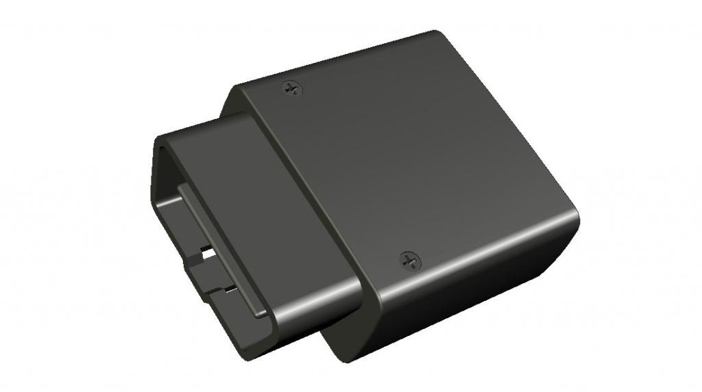

# Ulbotech - T380

The T380 is a plug-and-play OBDII GPS tracker from Ulbotech designed for vehicle tracking, telemetry, and driver connectivity. It combines cellular data communications with an integrated Wi‑Fi hotspot that supports multiple client devices, and it includes GNSS positioning and on-board motion sensing to provide continuous location and event data. The compact OBDII form factor enables quick deployment without hardwiring while exposing the core telemetry needed for fleet oversight, anti-theft control, and driver behavior monitoring.

As a device listed as compatible with Plaspy, the T380 can feed location fixes, motion events, and input/output states directly into the Plaspy platform for live maps, alerts, and historical reporting. Its Wi‑Fi bridging, remote update capability, and automatic configuration features make it suitable for both single vehicle monitoring and larger fleet rollouts managed through Plaspy, offering a blend of visibility and operational control that integrates with Plaspy workflows.

## Key Highlights

- Plug-and-play OBDII installation for quick deployment and immediate vehicle telemetry.
- 4G LTE modem combined with a Wi‑Fi hotspot to provide real-time tracking and passenger or driver connectivity.
- GNSS positioning with a high performance receiver for reliable location fixes.
- On-board 3‑axis accelerometer and motion sensing for event logging and driver behavior detection.
- Digital immobilizer output and multi-function input for anti-theft actions and basic remote control.
- Wi‑Fi bridging to reduce cellular data consumption while maintaining telematics connectivity.
- Remote firmware update capability and automatic APN and time zone handling for simplified fleet management.

## How It Works with Plaspy

When integrated with Plaspy, the T380 uploads location and telemetry so fleet managers and operators can monitor vehicles in real time, receive event alerts, and generate reports. Plaspy ingests GNSS fixes, accelerometer events, and input/output states to provide mapping, alerting, and historical analysis. The device's Wi‑Fi hotspot and bridging help preserve connectivity and reduce cellular usage without interrupting data flow to Plaspy.

- Real-time position updates for live tracking, route visibility, and geo-fence alerts inside Plaspy.
- Motion and driver behavior telemetry sent to Plaspy for event detection, driver scoring, and incident review.
- Ignition and immobilizer state reporting for anti-theft workflows and remote vehicle control actions where configured in Plaspy.
- Wi‑Fi hotspot and bridging support to maintain data uplinks and reduce cellular costs while keeping Plaspy updated.
- Remote management and over the air updates to deploy firmware and configuration changes with minimum manual intervention.

## Typical Use Cases

- Fleet management for route monitoring, dispatch support, and operational visibility.
- Anti-theft protection and immobilization workflows using remote engine cut control and location alerts.
- Driver behavior and safety programs driven by accelerometer event logging and analysis.
- Rental, insurance, and vehicle monitoring for usage based services and incident reporting.
- Roadside assistance and on the move connectivity where the onboard Wi‑Fi hotspot supports technicians and drivers.

## Why Choose This Tracker with Plaspy

The T380 pairs a practical plug-and-play OBDII form factor with telematics features that align well with Plaspy's platform capabilities. Its combination of GNSS positioning, motion sensing, and digital I/O for immobilizer control delivers core telemetry and control points that many fleet programs require. Built in Wi‑Fi hotspot and bridging can lower cellular expenses and keep devices connected, while remote update and auto configuration features make large scale deployments easier to manage.

When used with Plaspy, the T380 becomes a reliable data source for live tracking, event alerting, and historical reporting. Organizations looking for a compact, vehicle powered tracker that supports driver connectivity and basic remote control functionality will find the T380 a practical option to integrate into Plaspy managed workflows.

To learn more about how Plaspy supports devices like the Ulbotech T380 visit https://www.plaspy.com. Product specifications, availability, and manufacturer details can change over time, so please verify current technical information on the manufacturer site http://www.ulbotech.com/ before finalizing procurement or deployment plans.
