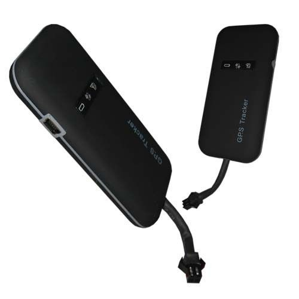

# UVI Group - GT02

The UVI Group GT02 Mini Portable Car Vehicle Tracker GPS GSM GPRS Track System Device is a compact and powerful locator designed for monitoring and managing company vehicles and private cars. It is an effective anti-theft device that provides real-time tracking and monitoring capabilities. With its intelligent positioning and GPRS technology, the tracker can send GPS data to a designated site, allowing users to access the latest information about the vehicle's position, speed, and direction through mobile phones or computers.

The GT02 tracker operates on a GPS/GSM/GPRS wireless network and features a high-sensitivity GPS chipset for accurate positioning. It is designed to start working automatically after being electrified and has a built-in ON/OFF power with a wide voltage input range. The tracker also has a monitoring CPU that can eliminate breakdowns automatically, ensuring reliable performance. Installation is easy, with options for open or hidden installment. The GT02 tracker can be powered by a car-specific joint or the car battery, providing flexibility and convenience.

Key Features:

- GPS/GSM/GPRS wireless network
- High-sensitivity GPS chipset
- Intelligent activation of GPS positioning
- Automatic start after electrifying
- Built-in ON/OFF power with wide voltage input range
- Built-in monitoring CPU for automatic breakdown elimination
- SMS commands and location information
- Easy installation with open or hidden options
- Two power input approaches: car-specific joint or car battery

The UVI Group GT02 Mini Portable Car Vehicle Tracker GPS GSM GPRS Track System Device supports GSM frequencies of 850/900/1800/1900MHz and does not support 3G/4G/CDMA networks. It has a built-in GSM module with Class2 GPRS and TCP/IP capabilities. The GPS module used is SIRF Star III/LP, providing reliable and accurate positioning. The tracker has a tracking sensitivity of -159dBM and an acquisition sensitivity of -144DBM. The GPS positioning time is fast, with a hot start of less than 2 seconds \(in open sky conditions\), a warm start of less than 15 seconds, and a cold start of less than 38 seconds \(in open sky conditions\). The GT02 tracker has a built-in GSM and GPS antenna with low noise and high gain for optimal signal reception. It features power and SOS function buttons, as well as LED indicators for GPS, GSM, and power status. The dimensions of the tracker are 90\*45\*12mm, and it weighs 45g.

