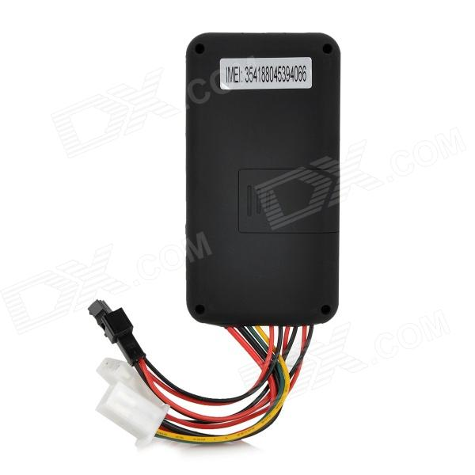

# UVI Group - GT06

The UVI Group GT06 is a compact GPS tracker designed to provide accurate real time tracking of remote targets such as vehicles and motorcycles. It uses GPS satellites for positioning and the GSM GPRS network to report location information, offering both SMS based location queries and server upload for continuous monitoring. Its small form factor and straightforward wiring make it suitable for business, rental, and personal vehicle monitoring including anti theft use cases.

As a Plaspy compatible device, the GT06 can forward its location data to internet based tracking platforms for live visibility and historical logs. Plaspy can ingest location reports sent from the tracker so fleet managers and administrators can view positions on maps, run reports, and monitor assets in near real time. The GT06 practical feature set and global GSM support make it a logical candidate for organizations that want a simple, server integrated tracking device paired with Plaspy for operational oversight.

## Key Highlights

- Real time GPS positioning suitable for vehicle and motorcycle tracking
- Sends location via SMS or uploads data over GPRS to a server for live tracking
- Worldwide GSM quad band support for broad geographic coverage
- UBLOX GPS chip and MTK60 GSM module noted for reliable positioning
- Compact physical size and low power consumption for long term use
- Practical voltage tolerance for common vehicle power systems
- Manufacturer stated positioning accuracy around 10 meters under typical conditions

## How It Works with Plaspy

The GT06 sends its GPS coordinates either via SMS or by uploading data over the mobile data network to an internet server. When configured to report to Plaspy, those uploads become live position updates and historical events inside the Plaspy platform for centralized fleet visibility and management.

- Live position updates appear on Plaspy maps for monitoring vehicles and assets
- Historical routes and trip playback are available for review and reporting
- Alerting and event triggers in Plaspy can be tied to GT06 reports for operational notifications
- Fleet dashboards provide an overview of asset status and recent locations
- Exportable location history and summary reports support operational analysis

## Typical Use Cases

- Fleet tracking for small commercial vehicle groups and delivery fleets
- Rental vehicle monitoring to track location and usage
- Motorcycle tracking for theft deterrence and recovery support
- Remote asset oversight where compact hardware and simple reporting are needed
- Business operations wanting basic real time visibility without complex hardware requirements

## Why Choose This Tracker with Plaspy

The GT06 combines straightforward tracking capabilities with broad GSM compatibility, making it a practical option for organizations that need dependable location reporting and a simple path to platform integration. Its SMS and GPRS reporting options mean it can operate in environments where both text based queries and server based streaming are useful, and those reporting modes map well to the kinds of visibility Plaspy provides.

While the device offers a focused set of tracking features rather than an extensive telemetry suite, it is often a good match for users who prioritize reliable position updates, compact hardware, and global GSM coverage. When paired with Plaspy, the GT06 provides a clear route from raw location reporting to centralized monitoring, alerts, and reporting that support day to day fleet and asset management.

To learn more about how Plaspy can work with compatible trackers like the UVI Group GT06 visit https://www.plaspy.com. Product specifications, availability, and manufacturer details can change over time, so please verify current technical specifications and compatibility information on the UVI Group official site http://www.uvi-group.com/ before making procurement or deployment decisions.
