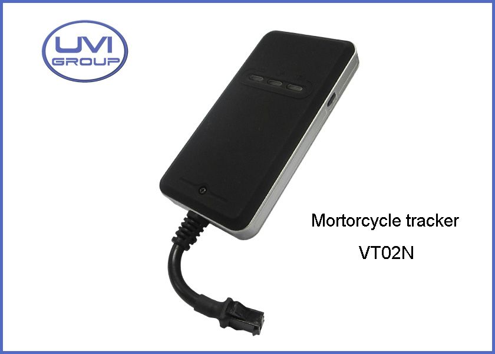

# UVI Group - VT02N

The UVI Group VT02N is a compact and stylish GPS vehicle tracker that offers real-time tracking and monitoring capabilities. With its mini size and plastic cover, it is easy to install and discreetly monitor your vehicles. The device is equipped with GSM Quad band technology, ensuring reliable and efficient communication.

One of the standout features of the VT02N is its intelligent software mechanism and smart hardware design. It incorporates intelligent power-saving technology, allowing for extended battery life and reducing the need for frequent recharging. The device also boasts static drift resistance, ensuring accurate and reliable tracking even in challenging environments. Additionally, the VT02N features a simple and reliable connector and a wide voltage input range, making it compatible with a variety of vehicles.

Whether you need to track a fleet of vehicles for business purposes or simply want to keep an eye on your personal vehicle, the UVI Group VT02N is an excellent choice. Its compact size, easy installation, and reliable performance make it a top-notch GPS vehicle tracker.

