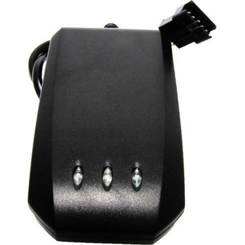

# V-SUN - TLT-2N

The V-SUN TLT-2N is a GPS/GSM car positioning and tracking device that utilizes GPS technology and GSM/GPRS technology. It is designed to provide accurate positioning and tracking of vehicles, motorcycles, electric golf carts, and private cars. With its built-in high-performance GPS chipset, the TLT-2N can provide accurate positioning even in areas with weak signals or sight-limited districts. It supports both SMS communications and GPRS TCP connection, allowing users to receive position information through cell phone messages or track the movement of the vehicle on the internet.

One of the standout features of the TLT-2N is its wide compatibility. It supports GSM900/1800MHz \(850/1900 MHz\), making it compatible with networks worldwide. The device also offers a range of useful functions, including SOS, fuel/electricity shut-off, geo-fence function, overspeed warning, and historical data upload. It is equipped with a power-saving function, allowing for improved battery life in electricity-saving mode. The TLT-2N is designed with a highly reliable electric circuit and complies with electronic industry standards, ensuring its durability and performance.

With its compact dimensions of 88mm×51mm×19mm and easy installation process, the V-SUN TLT-2N is a reliable and versatile GPS tracker that provides accurate positioning and tracking for various vehicles. Whether you need to keep track of your motorcycle, electric golf cart, or private car, the TLT-2N offers the features and functionality to meet your needs.

### Key Features:

- Built-in high-performance GPS chipset for accurate positioning
- Supports GSM900/1800MHz \(850/1900 MHz\) for worldwide compatibility
- Supports SMS communications or GPRS TCP connection for position information
- Functions include SOS, fuel/electricity shut-off, geo-fence, overspeed warning, and historical data upload
- Power-saving function for improved battery life
- Compact dimensions and easy installation

### Specifications:

| Hardware Parameter |  |
| --- | --- |
| GSM module | MTK GSM/GPRS chipset |
| GSM frequency | GSM 900/1800 double frequency, or GSM 900/1800/850/1900 four frequency \(optional\) |
| GPS chip | GPS chip set with high sensitivity |
| GPS sensitivity | -165dBm |
| GPS frequency | L1, 1575.42MHz |
| Code | C/A Code |
| Channel | 66-channel, omnibearing tracking |
| Position accuracy | &lt;2.5m, CEP |
| Speed accuracy | 0.1m/s |
| Time accuracy | 1us and synchronous with GPS time |
| Coordinates | WGS-84 |
| Reacquisition | 0.1s on average |
| Hot start | 1s on average |
| Warm start | 30s on average |
| Cold start | 32s on average |
| Altitude Limit | Maximum 18,000 meters \(60,000 feet\) |
| Velocity limit | Maximum 515m/s \(1000 knots\) |
| Acceleration Speed limit | Less than 4g |
| Working temperature | -25℃ to 70℃ |
| Humidity | 5%~95% non-concretion |
| Dimension | 88mm×51mm×19mm |
| Voltage | 12-24V |

