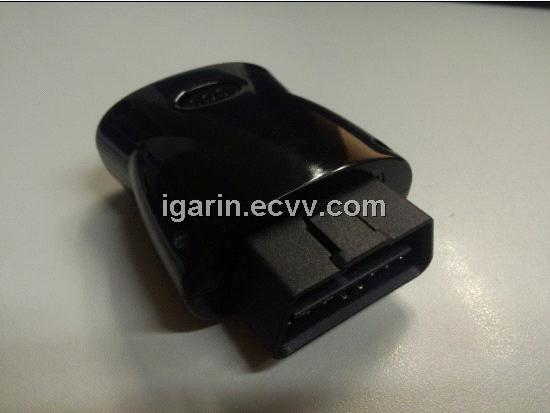

# V-SUN - TLT-8A

The V-SUN TLT-8A is a GPS/GSM car tracker designed for reliable positioning and tracking across a range of small vehicles. It pairs a built-in high performance GPS chipset with GSM/GPRS communications to deliver positioning even in challenging signal environments such as dense urban areas or valleys. The device supports worldwide GSM bands and provides location reporting through SMS or GPRS TCP, plus a suite of practical vehicle monitoring functions.

As a Plaspy compatible device, the TLT-8A can feed location and event data into Plaspy for visualization, alerting, and historical analysis. Its feature set — including SOS, geo fence alerts, overspeed warnings, and historical data upload — maps well to common fleet and asset management workflows supported by Plaspy, making it a practical choice for users who need continuous visibility and event based monitoring.

## Key Highlights

- Built in high performance GPS chipset for improved positioning accuracy in challenging environments
- GSM900 1800 support with alternate band compatibility for global coverage
- Dual reporting options via SMS or GPRS TCP for flexible data delivery
- Multiple safety and control features including SOS, geo fence, and overspeed warnings
- Functions for fuel or electricity shut off and external power wire alerts for operational control
- Power saving mode to extend standby time and reduce maintenance intervals

## How It Works with Plaspy

When integrated with Plaspy, the TLT-8A supplies position updates and event reports that Plaspy displays and archives for operational use. Plaspy ingests the device information and turns raw reports into live map locations, timeline views, and actionable alerts for fleets and vehicle owners.

- Real time location display on Plaspy maps using position packets delivered by the tracker
- Historical route playback and stored trip data shown in Plaspy reporting tools
- Event based alerts in Plaspy for SOS triggers, geo fence entries and exits, and overspeed occurrences
- Recorded status changes such as power cut warnings or authorized fuel and electricity shut off events available in Plaspy logs
- Reporting and exportable logs for operational review and compliance activities

## Typical Use Cases

- Monitoring private cars for theft recovery and driver safety
- Tracking motorcycles and small two wheeled vehicles for personal or business fleets
- Managing electric golf carts and similar low speed vehicles on campuses and resorts
- Small fleet visibility for route monitoring, trip history, and basic compliance reporting
- Remote alerting for sudden events such as SOS or unexpected power disconnection

## Why Choose This Tracker with Plaspy

The TLT-8A is a practical option for organizations and individuals who need straightforward vehicle tracking with a blend of real time reporting and event driven functions. Its compatibility with common GSM bands and flexible reporting methods make it suitable for varied operating regions, while on device features like geo fence and SOS align with Plaspy capabilities for alerting and historical review.

Because product literature for third party trackers can be compact, choosing the TLT-8A with Plaspy is best when your priority is dependable positioning and a useful set of vehicle control and alert features. Plaspy adds operational visibility and reporting, turning device reports into dashboards, alerts, and records that support everyday fleet management needs.

To learn more about how Plaspy supports device integrations and fleet workflows, please visit https://www.plaspy.com. Product specifications, availability, and manufacturer details can change over time, so verify current technical specifications and compatibility on the official V-SUN website http://www.v-sun.cc/.
