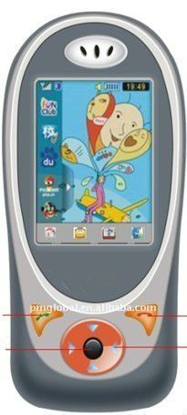

# V-SUN - V-580

The V-SUN V-580 Child Tracking Device is a GPS phone specifically designed for primary school students. With its cute cartoon design, it appeals to children while providing parents with peace of mind. The device features an internal high sensitivity GPS module, allowing parents to send text messages to inquire about their child's current location. Parents can also set the phone to refuse to send and receive messages during class time, ensuring that their children stay focused on their studies. 

One of the standout features of the V-580 is its unique notification function. Parents will receive reminders when their child arrives home, arrives at school, or leaves school, providing a comprehensive level of protection and security. This feature allows parents to stay informed about their child's whereabouts at all times. 

In addition to GPS satellite positioning and real-time location tracking, the V-580 offers an intelligent emergency call feature. In case of an emergency, the child can simply press the SOS button for help. This feature provides an added layer of safety and ensures that help can be quickly summoned when needed. 

The V-580 also includes electronic fences, which alert parents when their child goes outside of a predefined security zone. This feature is particularly useful for ensuring that children stay within safe boundaries and can provide parents with peace of mind when their child is out and about. 

Furthermore, the V-580 offers remote monitoring capabilities, allowing parents to know what their child is doing at all times. This feature enables parents to keep a watchful eye on their child's activities and ensures that they are always aware of their child's well-being. 

Lastly, the V-580 includes a class stealth feature, which allows schools to limit students' phone usage during class time. This feature can help prevent distractions and ensure that students are focused on their studies. 

With its range of features designed to enhance child safety and provide parents with peace of mind, the V-SUN V-580 Child Tracking Device is an excellent choice for parents looking to keep track of their child's whereabouts and ensure their safety.

