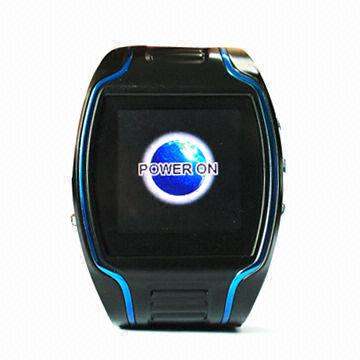

# V-SUN - V-680

The V-SUN V-680 GPS tracker is a versatile and reliable device that offers a range of useful features for personal and professional use. With its compact design and advanced technology, this tracker is perfect for keeping track of vehicles, assets, and loved ones. 

One of the standout features of the V-680 is its two-way call function, allowing you to communicate with the tracker remotely. This can be especially useful in emergency situations, as the device also includes an SOS emergency alarm. Additionally, the V-680 offers auto-answer capabilities, remote monitoring, and mode shifting, giving you full control and flexibility over your tracking experience. 

In terms of hardware, the V-680 is built to withstand various conditions. It has a wide working temperature range of -20°C to 65°C, making it suitable for use in extreme environments. The device is also designed to be durable, with a humidity resistance of 5% to 95%. 

When it comes to accuracy, the V-680 delivers precise positioning with an accuracy of 3.0 meters in 2D-RMS mode. It also offers speed positioning with an accuracy of 0.1m/s. This level of accuracy ensures that you can track your assets or loved ones with confidence. 

Overall, the V-SUN V-680 GPS tracker is a reliable and feature-packed device that offers advanced tracking capabilities. Whether you need to keep an eye on your vehicles, assets, or loved ones, this tracker has you covered. With its impressive range of features and durable design, the V-680 is a top choice for anyone in need of a high-quality GPS tracking solution.

### Key Features:

- Two-way call function for remote communication
- SOS emergency alarm for added safety
- Auto-answer capabilities for convenience
- Remote monitoring for real-time tracking
- Mode shifting for flexible usage
- Precise positioning with 3.0 meters accuracy
- Speed positioning with 0.1m/s accuracy
- Durable design with wide working temperature range

