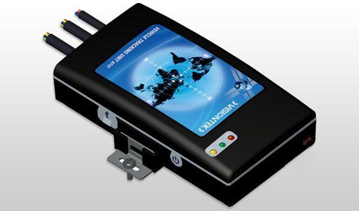

# VisionTek - 87VTU

The VISIONTEK 87VTU is a powerful vehicle tracking unit that combines a built-in GPS receiver engine, quad-band GSM modem, and a new generation microprocessor. It also features inbuilt flash memory, a USB port, hard reset button, tamper switch, 3D motion sensor, 3 LED indicators, internal battery, digital/analog inputs, digital outputs, serial port, and a 1-wire feature. This device is designed to acquire, monitor, and transmit position, date, time, and direction data to a server in the form of packets or SMS.

The VISIONTEK 87VTU is equipped with a USB port for firmware uploading and device configuration, as well as capturing GSM/GPS logs. It has three LEDs to indicate the health status of the device \(GSM, GPS, and power\). The 3D motion sensor helps identify sleep/motion and reduces data and power consumption. Additionally, this tracking unit offers various software features such as password protection, SIM lock, geofence, sleep mode, fall back SMS, store and forward \(history data\), track on demand, OTA commands, and remote firmware update.

The VISIONTEK 87VTU is housed in an IP65 plastic enclosure and comes with internal GSM and GPS antennas. It also has provision for an external GSM/GPS antenna for better performance. With its advanced features and robust design, this tracking unit is suitable for a wide range of applications including fleet management, ambulance management, taxi/cabs, logistics, education institutions, boats, ships, and more.

### Key Features:

- Built-in GPS receiver engine
- Quad-band GSM modem
- New generation microprocessor
- Inbuilt flash memory
- USB port for firmware uploading and device configuration
- Hard reset button
- Tamper switch
- 3D motion sensor
- 3 LED indicators \(GSM, GPS, and power\)
- Internal battery
- Digital/analog inputs
- Digital outputs
- Serial port \(RS 232\)
- 1-wire feature
- IP65 plastic enclosure
- Internal GSM and GPS antennas
- Provision for external GSM/GPS antenna\*

