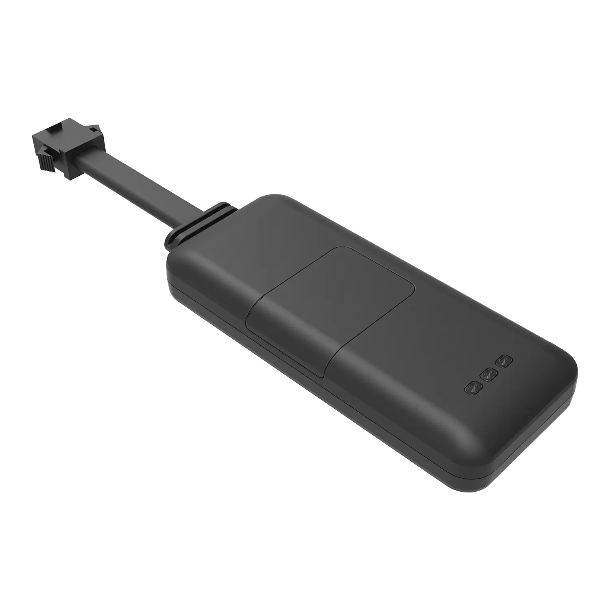

# WanWay - EV02

The EV02 is a compact 2G GPS tracker from WanWay designed for vehicle anti theft protection and efficient fleet management. Its small form factor and high sensitivity positioning make it suitable for motorcycles, cars, light commercial vehicles, and electric vehicles, providing reliable real time location data and event reporting for asset security and operational oversight.

Plaspy compatibility is built in, so the EV02 can forward location, status, and security events directly to the Plaspy platform for monitoring, alerts, and history. That integration makes the EV02 useful for fleets and security operators who need tracked positions, tamper notifications, and remote immobilizer controls available inside a centralized fleet management environment.

## Key Highlights

- Plaspy compatible 2G GPS tracker offering consistent real time tracking and alerting in 2G covered areas.
- Compact design and discreet mounting suited to motorcycles, cars, light commercial vehicles, and electric vehicles.
- Small internal backup battery for short term power backup to support location reporting during power interruptions.
- Wide operating voltage range to simplify deployment across mixed vehicle types with varying power systems.
- Active anti theft capabilities including remote cut off of petrol or electrical power and immobilizer style control.
- Cut wire and ACC detection plus vibration alarm for rapid tamper and unauthorized movement alerts.
- High sensitivity GPS positioning for prompt online location updates and reliable geolocation data.

## How It Works with Plaspy

When paired with Plaspy, EV02 streams location and event data to the platform so operators can monitor assets in near real time, receive alarms, and act on remote controls where supported by the installation. Plaspy surfaces the tracker’s telemetry and security events in dashboards and reports to help teams respond and analyze fleet behavior.

- Live location updates and movement state for map tracking and historical playback.
- Ignition and cut wire status reported to Plaspy to support trip logging and detect unauthorized use.
- Vibration and tamper alarms sent as immediate notifications to improve response times for security teams.
- Remote immobilizer or cut off actions available through Plaspy when wiring and installation provide that capability.
- Inclusion in geofence rules and alert workflows for automated perimeter monitoring and incident notification.
- Consolidated event history and reports for operational review and recovery analysis.

## Typical Use Cases

- Fleet anti theft and remote immobilization for quicker recovery and reduced loss exposure.
- Mixed vehicle deployments where a single tracker model can operate across motorcycles, cars, and light commercial vehicles.
- Security for electric vehicles using discreet mounting and responsive alarm reporting.
- Route tracking and trip logging using position updates and ignition state for utilization analysis.
- Concealed installations to support recovery operations after theft or tampering.
- Small vehicle and asset monitoring where space and discrete installation are priorities.

## Why Choose This Tracker with Plaspy

EV02 is a practical option for organizations that need a small, reliable tracker compatible with Plaspy for centralized visibility and alerting. Its compact footprint and tolerance for a wide range of vehicle power systems make it adaptable across mixed fleets, while built in anti theft features such as remote cut off, cut wire detection, and vibration alarms provide core security functionality without added complexity.

Paired with Plaspy, EV02 enables consolidated telemetry, timely alarms, and basic remote control actions so operators can maintain oversight, improve response, and generate useful reports for fleet management. If you need dependable tracking and essential vehicle security features integrated into a Plaspy workflow, EV02 is worth considering for mixed fleet environments.

To learn more about how Plaspy works with compatible trackers and fleet management features visit https://www.plaspy.com. Product specifications and availability can change over time, so please verify current details and official documentation on the manufacturer site https://www.wanwaytech.net/.
