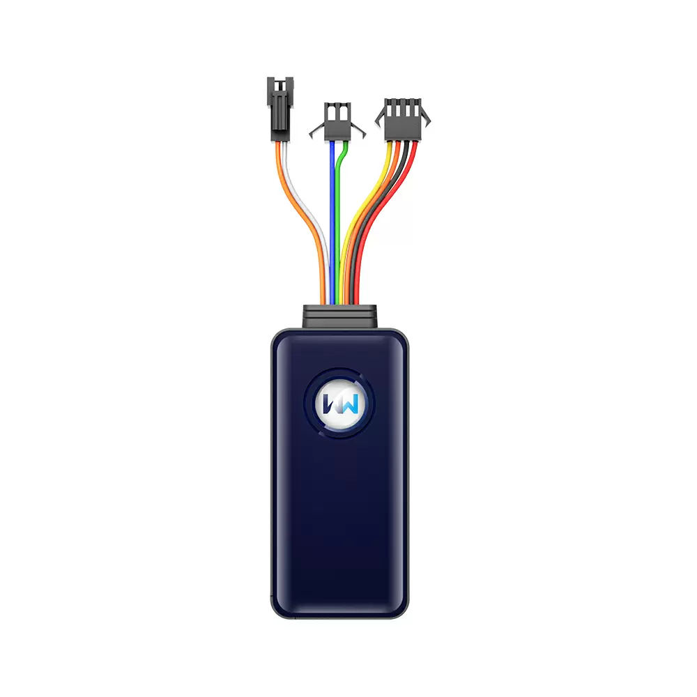

# WanWay - G19S

The WanWay G19S is a compact GPS tracker that combines GPS positioning with GSM connectivity and built in antennas and sensors. At 83mm by 40mm by 14mm and weighing approximately 54g, the device is designed for discreet placement in a wide variety of vehicle types. Key on device functionality includes ACC detection, vibration alarm, SOS emergency call, remote cut off of petrol or electricity, and the option to connect a microphone for audio monitoring. The G19S also provides trace playback, SMS notifications, waterproof protection, and a stated GPS accuracy of 5 meters or better.

As a model confirmed compatible with Plaspy, the G19S can feed its location and event data into Plaspy for centralized monitoring, alerts, and reporting. Plaspy can show real time location, historical routes, and device generated alerts from the G19S alongside other fleet devices, making it straightforward to include the G19S in broader operational workflows. Because the tracker supports a wide input voltage range and quad band GSM frequencies, it is a practical choice for many vehicle deployments that need to be visible and managed within the Plaspy platform.

## Key Highlights

- Real time GPS tracking with published accuracy of 5 meters or better
- Compact and lightweight form factor suitable for discreet vehicle placement
- Built in sensors and alarms including ACC detection, vibration alarm, and SOS call
- Remote cut off capability for petrol or electricity as a security option
- Support for trace playback and SMS notifications for past route review and alerts
- Wide input voltage compatibility and quad band GSM support for broad vehicle compatibility

## How It Works with Plaspy

The G19S can transmit its GPS positions and alarm events to Plaspy where the platform consolidates that data for maps, alerts, and reporting. Once connected, Plaspy treats the G19S like other compatible trackers so fleet managers and vehicle owners can monitor locations, review routes, and respond to alerts from a single interface.

- Real time location display on Plaspy maps for one vehicle or an entire fleet
- Alert handling for SOS, vibration, ACC events and other device generated alarms
- Trace playback in Plaspy to review historical routes and movements reported by the G19S
- Centralized notifications and reporting to support operational oversight and record keeping
- Representation of remote control actions such as cut off where the device and account configuration permit

## Typical Use Cases

- Private vehicle security and theft deterrence with SOS and vibration alerts
- Fleet management for small and medium vehicle fleets requiring real time visibility
- Rental and shared vehicle monitoring to track usage and review trip history
- Logistics and delivery operations that need route playback and centralized alerts
- Asset protection for valuable mobile equipment that benefits from discreet installation

## Why Choose This Tracker with Plaspy

The G19S is a practical option when compact size, multiple alarm types, and reliable positioning are required. Its combination of real time tracking, event reporting, and trace playback makes it useful for organizations that want straightforward location visibility without a large hardware footprint. Paired with Plaspy, the G19S data is available in a platform designed for fleet oversight, alert management, and historical review, so teams can operationalize the tracker output alongside other devices.

Because manufacturer specifications and available features can vary by firmware revision and regional models, Plaspy focuses on presenting the data and events that the device transmits. This approach helps teams adopt the G19S into existing monitoring and reporting workflows while keeping device behavior transparent in the Plaspy interface.

To learn more about how Plaspy can manage WanWay devices and the G19S model, visit the Plaspy website at https://www.plaspy.com. Product specifications, availability, and manufacturer details can change over time, so please verify current specifications and feature lists on the official WanWay website at https://www.wanwaytech.net/.
