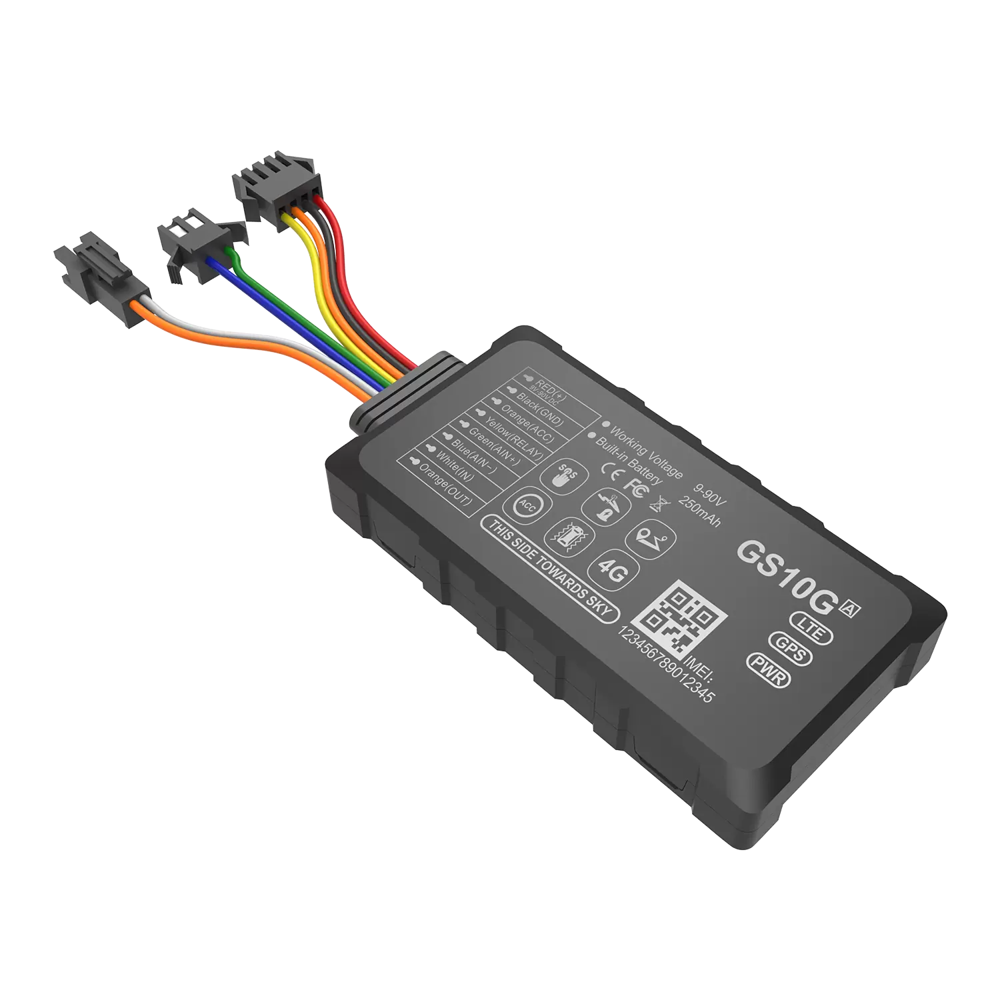

# WanWay - GS10G

# GS10G GPS Tracker

The GS10G is a professional 4G vehicle GPS tracker designed for reliable Plaspy compatible deployments. Built for fleet management, insurance applications, rental vehicles and passenger transport, the GS10G combines full Netcom 4G wireless communication with GPS/BDS satellite navigation to deliver accurate, real-time tracking and vehicle telemetry. Its feature set — including ACC/ignition detection, disassembly alarm, overspeed alerts, mileage statistics and remote fuel/power cut-off — makes it a dependable choice for operators who require secure location data and fast response to incidents.

As a Plaspy compatible device, the GS10G integrates easily into Plaspy’s platform to enable live location updates, event-driven alerts, and detailed reporting. The unit’s 1-Wire driver identification enables secure driver verification for compliance and efficient dispatching. Whether you need anti-theft protection, immobilizer control or fleet-level telemetry, the GS10G provides the core capabilities to support modern vehicle tracking workflows.

## Key Highlights

- Plaspy compatible 4G GPS tracker for reliable, real-time tracking and fleet management.
- Dual GNSS support \(GPS/BDS\) for better positioning accuracy and coverage.
- Driver authentication via 1-Wire driver identification to reduce unauthorized use and enable driver-based reporting.
- Built-in anti-theft protections: disassembly alarm, remote fuel/power cut-off and overspeed alerts.
- Vehicle telemetry and trip statistics including ACC/ignition detection and mileage tracking.
- Suitable for insurance, enterprise fleets, taxis, rentals, and electric/new energy vehicles.
- Designed for easy integration with Plaspy dashboard, alerts, and reporting workflows.

## How It Works with Plaspy

The GS10G sends location and event data over 4G to the Plaspy platform, where that information is processed for real-time monitoring, historical playback and automated alerts. Plaspy receives GNSS coordinates, status flags and telemetry from the tracker and translates them into actionable data for operations centers, dispatchers and vehicle owners. Integration is focused on delivering timely notifications and consistent reporting without extra hardware changes.

- Real-time location and telemetry updates delivered to Plaspy for live tracking and map visualization.
- ACC/ignition status reporting to trigger engine-related rules and automated workflows.
- Disassembly and overspeed alarms forwarded to Plaspy for immediate alerting and incident handling.
- Mileage statistics and trip logs available in Plaspy for maintenance scheduling and billing reconciliation.
- Remote fuel/power cut-off \(immobilizer\) control integrated into Plaspy for secure remote immobilization when authorized.
- 1-Wire driver identification data passed to Plaspy to verify authorized drivers and create driver-based reports.
- Works with vehicle telemetry feeds — and can be combined with Plaspy’s support for additional sensors and asset data where applicable.

## Technical Overview

| Connectivity | 4G Netcom wireless communication |
| --- | --- |
| Bands | Not specified in product description |
| Power & Battery | Not specified in product description \(vehicle-powered with remote power cut-off feature\) |
| Interfaces | ACC/ignition detection, disassembly alarm, remote fuel/power cut-off \(immobilizer control\), mileage statistics |
| GNSS | GPS and BDS satellite navigation |
| Bluetooth | Not specified in product description \(can be integrated with Plaspy-managed Bluetooth sensors where supported by the platform\) |
| Driver Identification | 1-Wire driver identification for authorized driver verification |
| Remote Management | Remote fuel/power cut-off \(immobilizer\) supported; additional remote management details not specified |
| Form Factor | Vehicle-mounted tracker for passenger cars, fleet vehicles and specialized applications |

## Use Cases

- Fleet management — monitor location, driver behavior, mileage and receive overspeed or disassembly alerts to improve safety and efficiency.
- Insurance telematics — use real-time telemetry and trip records for usage-based insurance and claim verification.
- Rental and taxi operations — verify driver identity with 1-Wire, enforce immobilizer policies and protect assets against theft.
- Auto dealerships and 4S stores — manage demonstration vehicles, track test drives and secure vehicles on the lot with anti-theft alarms.
- Electric/new energy vehicles — integrate vehicle telemetry and remote power control functions for energy management and security.

## Why Choose This Tracker with Plaspy

Connecting the GS10G to Plaspy gives fleets and operators a practical combination of dependable positioning, event-driven telemetry and secure driver verification. The device’s 4G connectivity and GPS/BDS positioning deliver real-time tracking performance, while key features such as ACC/ignition detection, disassembly alarm, overspeed alerts and remote fuel/power cut-off provide the anti-theft and immobilizer capabilities needed in demanding applications. Plaspy’s platform adds value by turning raw device data into reports, alerts and operational rules for better decision-making and faster incident response.

Whether you are upgrading a mixed fleet or deploying a new vehicle tracking program, the GS10G offers a compact, vehicle-focused solution that supports anti-theft protection, telemetry-driven maintenance and driver accountability. For organizations prioritizing reliability and practical fleet management features, pairing GS10G hardware with Plaspy’s software tools delivers a secure, scalable tracking solution.

