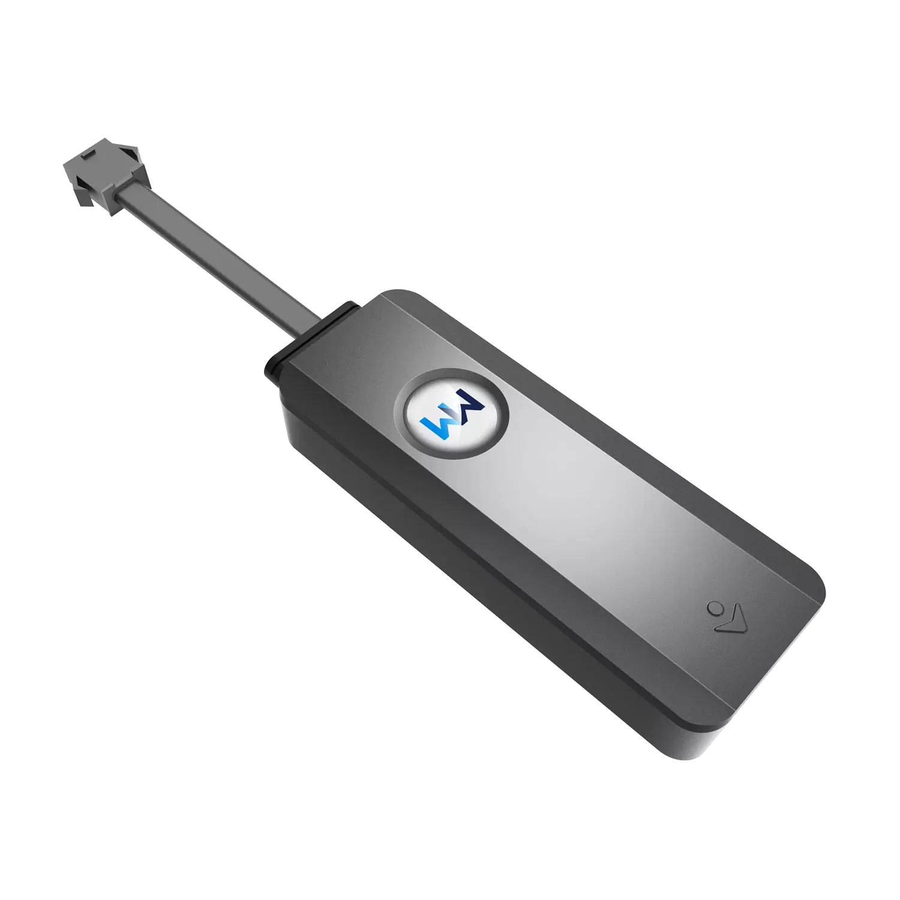

# WanWay - GS900

The GS900 is an intelligent vehicle GPS tracker designed for professional vehicle monitoring and security. Combining 4G full Netcom wireless communication with GPS/BDS satellite navigation, the GS900 delivers reliable real-time tracking and a suite of safeguards — ACC detection, disassemble alarm, overspeed alerts, mileage statistics, and remote cut-off of petrol or electricity — to protect vehicles and streamline fleet operations. As a Plaspy compatible device, the GS900 integrates smoothly with Plaspy's platform to provide live location, event alerts, and telemetric insights that fleet managers and vehicle owners need.

Whether you manage a mixed fleet, need robust anti-theft controls, or require accurate telemetry for maintenance and billing, the GS900 offers a practical balance of connectivity and vehicle-focused inputs. Its emphasis on remote immobilization and tamper detection makes it well-suited for fleet management, rental vehicle oversight, and security-conscious deployments where Plaspy's dashboards, alerts, and reporting are used to centralize operations.

## Key Highlights

- 4G full Netcom connectivity for consistent, low-latency real-time tracking across cellular networks.
- Dual GNSS support with GPS and BDS satellite navigation for reliable position fixing in varied environments.
- Vehicle inputs like ACC detection for ignition state monitoring and mileage statistics for operational telemetry.
- Comprehensive security: disassemble \(tamper\) alarm, overspeed alarm and remote petrol/electricity cut-off \(immobilizer\) for anti-theft response.
- Real-time tracking and event reporting that feed directly into Plaspy for immediate alerts, historical playback, and analytics.
- Practical deployment model for fleet management — focused on durability, vehicle integration, and centralized control via Plaspy.

## How It Works with Plaspy

The GS900 communicates vehicle position and event data to Plaspy over its 4G connection, enabling dashboards, geofencing, alerting, and historical reporting. Plaspy receives the tracker’s telemetry and event messages and converts them into actionable items: live map pins, route playback, overspeed and tamper alarms, mileage reports, and remote control actions. Integration is straightforward: once the GS900 is registered in Plaspy, data flows securely to the platform for visualization and automated workflows.

- Real-time location and telemetry updates delivered to Plaspy for live monitoring and route playback.
- Ignition \(ACC\) status and mileage statistics appear in Plaspy reports to support maintenance scheduling and fuel-efficiency analysis.
- Disassemble/tamper and overspeed alarms trigger immediate notifications in Plaspy for rapid response.
- Remote immobilizer capability \(cut-off petrol/electricity\) can be activated from Plaspy where operational policies allow secure remote control.
- Plaspy also supports supplementing trackers with Bluetooth sensors where required; while GS900’s description does not list BLE, Plaspy’s platform can incorporate BLE sensor data from compatible hardware to extend fuel monitoring and environmental telemetry workflows.

## Technical Overview

| Connectivity | 4G full Netcom wireless communication |
| --- | --- |
| Bands | Not specified \(varies by regional variant\) |
| Power & Battery | Vehicle-powered; backup battery not specified |
| Interfaces | ACC detection \(ignition input\); remote cut-off control for petrol/electricity \(immobilizer\); tamper/disassemble alarm input |
| GNSS | GPS and BDS satellite navigation |
| Bluetooth | Not specified in GS900 description \(Plaspy supports BLE sensors when used in a solution\) |
| Remote Management | Remote immobilizer control supported; FOTA and other management features not specified |
| Form Factor | Vehicle-mounted tracker intended for cars, vans and light commercial vehicles |

## Use Cases

- Fleet anti-theft and immobilization: remotely cut fuel or power in the event of unauthorized use and receive tamper alerts via Plaspy.
- Driver behavior and overspeed management: monitor speed events and enforce safe-driving policies across fleet vehicles.
- Mileage-based maintenance and billing: collect mileage statistics to schedule service intervals or calculate trip-based billing for rentals and deliveries.
- Real-time dispatch and logistics: track vehicle locations on Plaspy for efficient routing, ETA predictions, and live dispatch decisions.
- Security monitoring for high-value assets: use disassemble alarms and continuous tracking to protect vehicles in high-risk environments.

## Why Choose This Tracker with Plaspy

The GS900 is a pragmatic choice when you need a Plaspy compatible GPS tracker focused on vehicle security and fleet operations. Its 4G connectivity and GPS/BDS positioning provide dependable real-time tracking, while device-level features such as ACC detection, tamper alarms, overspeed alerts, and remote immobilization give operations teams direct control over safety and theft response. When combined with Plaspy’s platform, the GS900 becomes part of a unified solution for telemetry, fleet management, and anti-theft workflows — delivering faster incident response, clearer operational visibility, and centralized management without unnecessary complexity.

For organizations prioritizing reliable GPS tracker integration with Plaspy — whether for single vehicles or multi-vehicle fleets — the GS900 offers a balanced set of vehicle-focused capabilities. Its integration enables meaningful telemetry and operational controls that help reduce risk, improve driver compliance, and support efficient maintenance and dispatch routines. Contact your Plaspy administrator or GS900 supplier to confirm regional cellular variants and deployment best practices for full functionality in your operating area.

