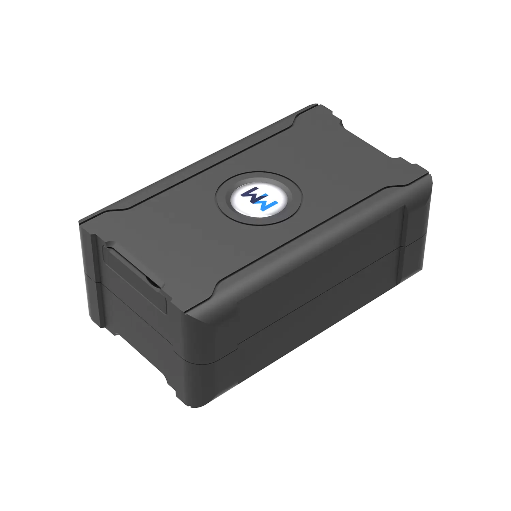

# WanWay - S20

The S20 Asset GPS Tracker is a self contained, battery powered tracker designed for flexible deployment across vehicles, trailers, containers and portable assets. Built with transport and logistics in mind, this unit is intended to provide reliable real time tracking and long term monitoring without permanent wiring, making it a practical choice when assets move between locations or when temporary installations are needed.

As a Plaspy compatible device, the S20 can be integrated into a single fleet management view to support rapid incident response, anti theft monitoring and consolidated operational telemetry. Its combination of extended battery life, a light sensor for disassemble alarm detection and a strong magnetic mounting option make the S20 a useful addition to Plaspy for teams that need portable, persistent visibility across dispersed assets.

## Key Highlights

- Plaspy compatible asset tracker offering real time tracking and historical playback across moving assets.
- Large battery capacity for extended standby and long term remote monitoring without permanent power.
- Light sensor based disassemble alarm to detect tampering and unauthorized removal.
- Strong magnetic mounting for quick attachment and relocation between vehicles containers or equipment.
- Multiple configurable alert protections to notify teams about motion tampering and other events.
- Compact self contained form factor designed for asset mobility and discreet placement.

## How It Works with Plaspy

When deployed on an asset the S20 transmits location and status updates that Plaspy ingests to provide centralized mapping, alerts and reporting. Because the device is built for extended battery operation, Plaspy can balance high frequency live tracking when needed with periodic reports for long term monitoring to conserve power.

- Real time location and status updates streamed into Plaspy for live tracking and mapping.
- Disassemble and tamper alerts from the light sensor feed into Plaspy alarm rules and notifications.
- Battery level and power state information help plan redeployment and maintenance in Plaspy dashboards.
- Historical tracking and route playback support incident investigation and utilization analysis.
- Plaspy can correlate S20 location and tamper telemetry with other fleet inputs when those data sources are present for a unified operational view.

## Typical Use Cases

- Container and trailer tracking across multi leg transport with tamper and battery monitoring.
- Refrigerated cargo logistics where persistent location visibility is needed across cold chain movements.
- Construction equipment and site asset monitoring for mobile machinery tools and portable items.
- Temporary or pooled fleet vehicles where trackers are moved between rented or shared assets.
- Protection of high value goods using magnetic mounting and tamper alerts to detect unauthorized access.

## Why Choose This Tracker with Plaspy

The S20 is a practical option for organizations that require flexible asset visibility without committing to permanent wiring. Its focus on long battery life, tamper detection and easy redeployment aligns well with Plaspy workflows for fleet monitoring, alarm management and historical reporting. Together they help reduce asset loss, speed incident response and simplify oversight across logistics and field operations.

To learn more about Plaspy and how the S20 can fit into your fleet or asset management strategy visit https://www.plaspy.com. Product specifications availability and manufacturer details can change over time so please verify current specifications on the WanWay official site https://www.wanwaytech.net/.
