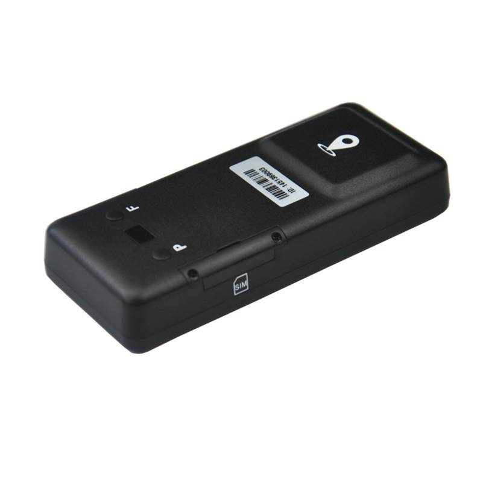

# Winrich - T28

The T28 is a long life vehicle GPS tracker engineered for extended unattended deployments and discreet installation. Marketed with an operating life of up to 2 years under low power configurations, the T28 is intended for situations where infrequent battery service and a compact, hidden form factor are priorities. Its design centers on ultra low power operation, configurable reporting intervals, and sleep/wake cycles to maximize endurance while preserving essential location reporting.

As a Plaspy compatible device, the T28 provides a practical option for teams that need dependable location visibility with minimal maintenance overhead. When integrated with Plaspy the device can add long term telemetry and periodic position updates to fleet management workflows, anti theft monitoring, and scheduled asset checks, giving operators consolidated visibility across vehicles, trailers, and other mobile equipment.

## Key Highlights

- Advertised operating life up to 2 years in low power configurations to reduce maintenance cycles.
- Compact design suitable for discreet or hidden installation in vehicles and mobile assets.
- Ultra low power modes and sleep wake cycles to extend battery endurance.
- Configurable reporting intervals to balance tracking frequency and energy consumption.
- Tamper and low battery alerts to support basic anti theft and device health monitoring.
- Optimized for long term asset tracking such as trailers, seasonal equipment, and cargo containers.

## How It Works with Plaspy

When connected to Plaspy the T28 sends periodic position and status updates according to its configured reporting schedule. Plaspy ingests those reports and presents them in maps, alerts, scheduled reports and fleet dashboards. Because the T28 is optimized for long standby times, operators should expect configured cadence updates rather than continuous high frequency streams, which helps preserve battery life while maintaining meaningful situational awareness.

- Near real time location updates based on the device reporting interval for map visualization and history.
- Tamper and low battery alerts forwarded into Plaspy so operators can act on potential theft or maintenance needs.
- Reporting interval configuration allows Plaspy to balance update frequency with battery conservation for each asset profile.
- Sleep and wake behavior is reflected in device health reporting to prevent false offline alarms in Plaspy.
- Compatibility reminder to confirm required network, APN and reporting protocol settings in the T28 configuration guide for smooth Plaspy onboarding.

## Typical Use Cases

- Fleet management for intermittently used vehicles where long battery life reduces field visits.
- Trailer and cargo container tracking during long dwell periods and seasonal movements.
- Seasonal equipment monitoring for machinery stored off season that needs occasional checks.
- Unattended asset protection and anti theft monitoring with periodic location updates and alerts.
- General long term asset tracking when discreet installation and extended service intervals are priorities.

## Why Choose This Tracker with Plaspy

The T28 is a sensible choice for organizations using Plaspy that prioritize long term autonomy and low maintenance overhead. Its long advertised operating life and configurable reporting strategy let fleet managers tune how often assets report location and health so Plaspy dashboards, geofence alerts, and historical reports stay useful without frequent battery service. For dispersed or seasonally used assets, the predictable periodic updates from the T28 fit well into Plaspy workflows that emphasize oversight and efficient operational checks.

If you are evaluating the T28 for deployment with Plaspy, review the device configuration guidance to ensure reporting settings match your operational needs. To learn more about Plaspy and how it can integrate device data into fleet management workflows visit https://www.plaspy.com. Product specifications, availability and manufacturer details can change over time, so please verify current technical information on the official Winrich website http://www.winrichgroup.com/en/.
