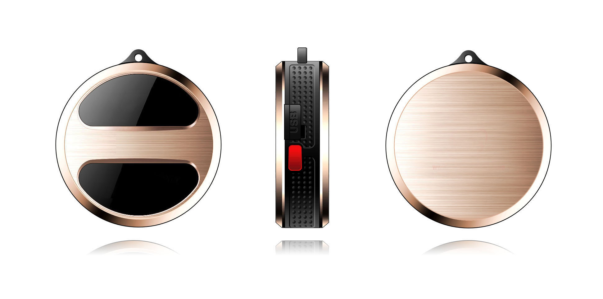

# Winrich - T8

The T8 is a compact personal GPS tracker engineered for reliable, Plaspy compatible real-time tracking of people, pets, and valuable assets. With a lightweight pendant-style form factor and easy USB charging, the T8 delivers continuous location updates via GPS and LBS, plus instant emergency alerts using its dedicated SOS button. Designed for everyday wear or attachment to small items, the T8 makes safety, supervision, and basic anti-theft monitoring simple to deploy with Plaspy.

As a Plaspy compatible device, the T8 feeds location, SOS alerts, geofence events, and connectivity/battery status into Plaspy dashboards and mobile apps. Its combination of GPS positioning and cellular LBS ensures location reports remain useful even in areas with limited satellite visibility, making the T8 a practical choice for personal safety, elderly care, pet tracking, and small asset protection.

## Key Highlights

- Compact pendant-style GPS tracker ideal for people, pets, or small assets — discreet and wearable for continuous monitoring.
- Plaspy compatible for smooth integration into real-time tracking dashboards, alerts, and reporting workflows.
- GPS and LBS positioning provide resilient location updates in both outdoor and marginal signal environments.
- Dedicated SOS button instantly sends an emergency alert with location to preconfigured contacts via Plaspy.
- Geofencing support enables automated notifications when the device enters or leaves predefined safe zones.
- Rechargeable internal battery with convenient micro USB charging and LED indicators for power, GPS, and GSM status.
- Lightweight, pendant-style form factor fits on keychains, lanyards, collars, or worn as a personal safety pendant.

## How It Works with Plaspy

The T8 transmits location and event data to Plaspy-compatible servers using its cellular connection and GNSS positioning. Plaspy ingests these inputs to provide live maps, configurable alerts, and historical playback. Integration focuses on the device’s core telemetry: periodic location, SOS events, geofence triggers, and connectivity/battery state. This combination enables Plaspy users to maintain situational awareness and respond quickly to incidents.

- Real-time location and telemetry updates \(GPS + LBS\) for continuous tracking on Plaspy maps.
- SOS/emergency alert reporting with location coordinates for immediate notifications to designated contacts.
- Geofence entry and exit notifications to automate safety alerts and boundary monitoring.
- Battery and GSM connectivity status updates to help monitor device health and maintenance needs.
- Simple onboarding into Plaspy: the T8 supplies the essential data Plaspy needs for personal safety and small-asset workflows.

## Technical Overview

| Model | T8 |
| --- | --- |
| Connectivity | Cellular \(GSM/LBS\) and GPS |
| Bands | Not specified in device description |
| Power & Battery | Rechargeable internal battery; micro USB charging port |
| Interfaces | Emergency SOS button; LED status indicators for power, GPS, and GSM |
| GNSS | GPS positioning with LBS fallback for areas with weak satellite signals |
| Bluetooth | Not specified in device description |
| Remote Management | Device status and events available to Plaspy for monitoring; firmware/management details not specified |
| Form Factor | Compact pendant-style wearable for keychain, lanyard, collar, or pendant use |

## Use Cases

- Personal safety and lone-worker protection: wear the T8 as a pendant for instant SOS alerts and location sharing through Plaspy.
- Elderly care and supervision: monitor location trends, geofence safe zones, and receive notifications if a loved one leaves a designated area.
- Child supervision and family tracking: lightweight design for backpacks or worn on a lanyard to keep tabs on children at school or outings.
- Pet monitoring and small asset protection: attach to collars or keyrings to locate pets or valuable portable items quickly.
- Short-term anti-theft and recovery: geofence and SOS features help detect unauthorized moves and support quick recovery actions via Plaspy alerts.

## Why Choose This Tracker with Plaspy

The T8 combines a wearable, user-friendly design with the essentials Plaspy customers need for dependable personal tracking. Its GPS and LBS positioning provide robust real-time tracking in environments where satellite signals vary, and the SOS button plus geofencing capabilities offer practical safety workflows right out of the box. For organizations and families seeking a Plaspy compatible GPS tracker that prioritizes ease of use, reliable location updates, and immediate alerting, the T8 is a focused solution.

Note on advanced vehicle features: while the T8 supports core telemetry and anti-theft monitoring for people and small assets, it does not list vehicle-specific inputs such as fuel monitoring, ignition sensing, immobilizer control, or Bluetooth sensors in its description. Plaspy supports those features in other compatible devices; customers seeking fleet management telemetry or vehicle control should evaluate specialized Plaspy-compatible vehicle trackers in addition to the T8.

