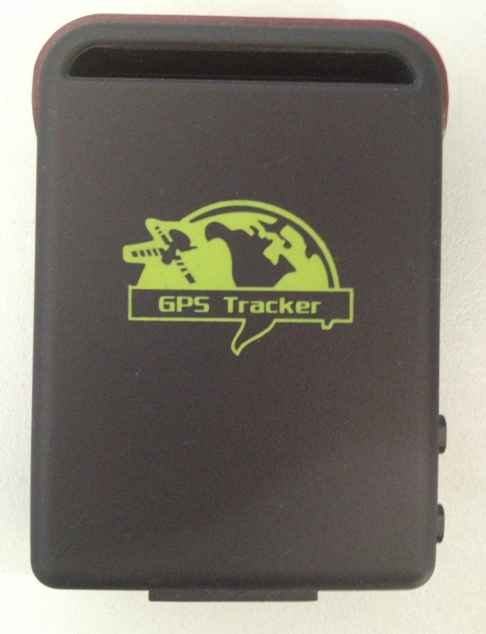

# Winrich - TK102B

The TK102B is a compact personal GPS tracker designed for reliable real time location monitoring across vehicles people and portable assets. It combines GPS and GSM positioning with onboard route backup on a TF card to maintain continuous location intelligence and basic anti theft capabilities. The unit is built for straightforward tracking scenarios where size portability and dependable updates matter.

As a Plaspy compatible device the TK102B can feed location updates alerts and stored route history into Plaspy for centralized visibility and management. Automatic APN configuration and the ability to preserve route logs when cellular service is interrupted help reduce data gaps and simplify integration into Plaspy based fleet monitoring staff safety and personal security workflows.

## Key Highlights

- Compatible with Plaspy for centralized mapping alerts and route logs.
- GPS and GSM dual positioning for continuous coverage and faster fixes.
- Real time tracking with periodic reporting and SOS emergency alerts.
- Geo fencing and overspeed alerts to support security and compliance policies.
- TF card route storage preserves history while GSM service is unavailable.
- Optional remote fuel or power cut off for additional anti theft control when installed in supported vehicles.
- Small lightweight form factor suitable for portable and covert placement.

## How It Works with Plaspy

When connected to Plaspy the TK102B streams position updates event triggers and stored route data into the Plaspy dashboard so operators can monitor assets in real time and review historical movements. Plaspy consolidates alerts and location records from the device providing mapping reporting and notification tools that improve situational awareness and operational response.

- Live position updates appear on Plaspy maps for immediate visibility.
- Geo fence and overspeed events generate alerts inside Plaspy for compliance tracking.
- SOS alerts and monitoring mode events are forwarded to Plaspy for rapid notification and follow up.
- TF card stored routes are uploaded to Plaspy when connectivity is restored to maintain continuous history.
- Optional remote fuel or power cut off can be integrated into Plaspy workflows for controlled immobilization in supported setups.

## Typical Use Cases

- Fleet management for light vehicles and small rental fleets requiring compact trackers.
- Anti theft protection for vehicles equipment and rental assets using geo fencing and immobilization options.
- Personal security for lone workers children or elderly individuals needing SOS alerts and discreet placement.
- Portable asset tracking where TF card backup ensures route history during intermittent connectivity.
- Short term or covert deployments that need a small form factor with real time updates.

## Why Choose This Tracker with Plaspy

The TK102B represents a practical, compact option for organizations and individuals that want dependable location updates and basic anti theft features integrated into Plaspy. Its combination of GPS accuracy GSM fallback and local route storage helps minimize gaps in telemetry while keeping hardware simple and portable. For teams that need centralized monitoring Plaspy brings the device data together into maps alerts and reports that support operational oversight and faster incident response.

Learn more about how the TK102B works with Plaspy on the Plaspy website https://www.plaspy.com. Product specifications availability and manufacturer details can change over time so please verify the latest technical information and compatibility with the manufacturer at http://www.winrichgroup.com/en/.
