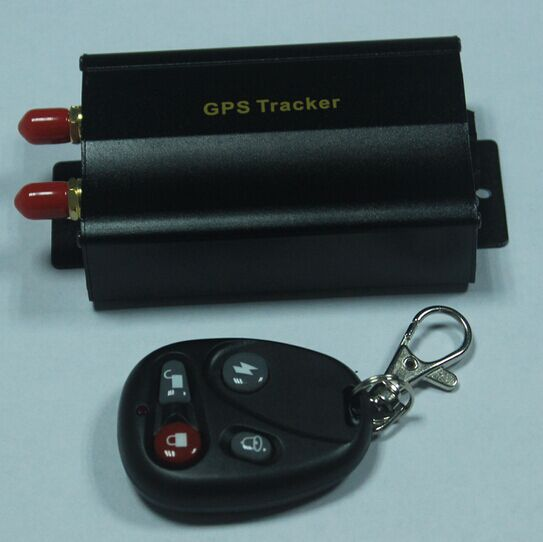

# Winrich - TK103

The TK103 is a compact vehicle GPS tracker engineered for continuous, Plaspy compatible real-time tracking and monitoring. Combining GPS satellite positioning with GSM/GPRS communications, the TK103 delivers reliable location reporting over GPRS/Internet or SMS, making it well suited for fleet management, personal vehicle protection, and general asset surveillance. Its small form factor and straightforward connectivity enable quick installation and immediate integration with Plaspy's online platform for live maps, alerts, and historical playback.

The device emphasizes security and operational continuity: emergency alarm reporting, multiple monitoring modes and automatic GPRS reconnection help ensure you receive critical telemetry and anti-theft notifications without interruption. Administrators can apply remote configuration from a terminal, and the TK103 supports single-vehicle as well as coordinated fleet setups \(point-to-point, point-to-group, group-to-group\), making it a practical choice for organizations that require scalable, Plaspy compatible tracking solutions.

## Key Highlights

- Plaspy compatible GPS tracker for reliable real-time tracking over GPRS and SMS.
- Dual-mode data transmission \(SMS/GPRS\) with automatic GPRS reconnection for continuous telemetry delivery.
- Emergency alarm reporting and monitoring modes to support anti-theft and security workflows.
- Remote configuration from a terminal reduces on-site maintenance and streamlines fleet management.
- Supports point-to-point, point-to-group and group-to-group monitoring for flexible fleet and asset coordination.
- Compact vehicle-focused form factor that installs discreetly in cars, vans, and mobile assets.
- Suitable for real-time location, alerting, and historical route playback within Plaspy's dashboard.

## How It Works with Plaspy

The TK103 communicates location and alarm data to Plaspy using its GPRS/Internet connection as the primary channel and SMS as a fallback. When connected via GPRS, the tracker pushes position fixes and telemetry to the Plaspy server in real time so fleet managers and security teams can view live positions, receive instant alerts, and generate reports. If the GPRS link is lost, the device can switch to SMS to ensure critical messages still reach administrators and Plaspy’s notification pathways.

- Real-time location and telemetry updates transmitted to Plaspy via GPRS/Internet.
- SMS fallback for essential notifications and emergency alarm reporting when data is unavailable.
- Support for grouped monitoring — Plaspy can display point-to-point, point-to-group and group-to-group relationships for coordinated fleet operations.
- Remote configuration capability allows Plaspy administrators to push settings and adjust reporting intervals from the platform \(where terminal support is enabled\).
- Integration-ready for telemetry and third-party sensors: ignition, immobilizer, fuel monitoring, or Bluetooth sensors can be handled within Plaspy if the specific vehicle installation or model variant exposes those inputs.

## Technical Overview

| Connectivity | GSM/GPRS cellular communications; supports SMS and GPRS/Internet data transmission |
| --- | --- |
| Bands | Not specified in provided description — please refer to manufacturer documentation for regional band support |
| Power & Battery | Vehicle-installed power \(typical for vehicle trackers\); backup battery details not specified |
| Interfaces | Supports alarm reporting and multiple monitoring modes; specific digital I/O, ignition input, or immobilizer wiring not detailed in description |
| GNSS | GPS satellite positioning for continuous location fixes \(accuracy not specified\) |
| Bluetooth | Not specified — Bluetooth sensors/beacons not described in provided information |
| Remote Management | Remote configuration from a terminal; automatic GPRS online reconnection and SMS/GPRS dual-mode switching |
| Form Factor | Compact vehicle tracker designed for cars, vans and moving-object applications |

## Use Cases

- Fleet management: live vehicle tracking, route history, and centralized monitoring across multiple vehicles via Plaspy.
- Anti-theft and emergency response: emergency alarm reporting and SMS/GPRS notifications help reduce recovery time for stolen or tampered vehicles.
- Telematics and operational oversight: regular position updates support dispatching, ETA calculations, and utilization reporting.
- Security surveillance of mobile assets: continuous location reporting and alarm alerts for trailers, rental vehicles, or high-value equipment.
- Coordinated group operations: point-to-group and group-to-group monitoring for convoy management or multi-vehicle job sites.

## Why Choose This Tracker with Plaspy

Choosing the TK103 as a Plaspy compatible GPS tracker gives you a dependable, straightforward option for vehicle tracking and fleet oversight. Its dual-mode SMS/GPRS communications and automatic reconnection behavior reduce data loss, while remote configuration simplifies administration for dispersed fleets. When paired with Plaspy, the TK103 becomes part of a larger telemetry and fleet management solution: you gain centralized dashboards, alerting rules, historical reports, and the ability to manage grouped vehicles in real time. For operations seeking a compact, security-oriented tracker that integrates into an existing Plaspy workflow, the TK103 balances simplicity, continuous tracking, and practical monitoring features.

