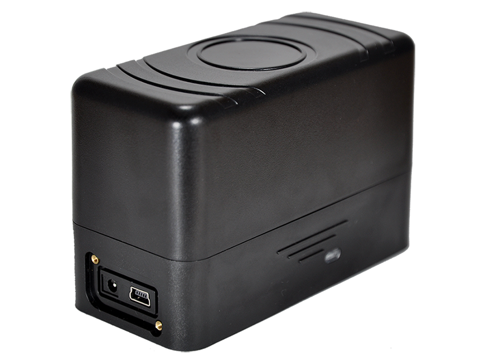

# WP - M7 D2

The WP M7 D2 is a portable GPS tracking device designed primarily for vehicle tracking. It combines high sensitivity GPS reception with quad band GSM communication and supports data transmission via SMS, GPRS, UDP, and TCP. The unit is compact, housed in an IP67 rated ABS enclosure, and uses magnetic mounting for quick installation or discreet placement on metal parts of a vehicle.

As a Plaspy compatible device, the M7 D2 can deliver location and event data that Plaspy ingests for monitoring and reporting. Its built in features such as motion reporting, detached alert, roaming preference settings, and long standby capability make it a practical option for organizations that want centralized visibility of mobile assets through the Plaspy platform.

## Key Highlights

- Portable magnetic mounting for fast placement and discreet installation on vehicles
- Multiple data transmission methods including SMS GPRS UDP and TCP for flexible reporting
- Long standby performance with a large rechargeable battery for extended deployments
- IP67 rated ABS enclosure for protection against dust and water exposure
- Built in tampering detection and motion reporting for improved security and route analysis
- Integrated 3 axis acceleration sensor and LED status indicator for on device feedback

## How It Works with Plaspy

When used with Plaspy, the WP M7 D2 sends location updates and event notifications that Plaspy presents in a unified fleet view. The device data is mapped to Plaspy features to provide operational oversight, alerting, and historical reporting without requiring deep technical changes to the tracker itself.

- Real time location display on Plaspy maps for live fleet visibility
- Event alerts such as device removal notifications and motion reports routed to Plaspy alerting
- Historical route playback and reporting to support reviews and operational analysis
- Low battery and power management notifications surfaced in Plaspy for maintenance planning
- Centralized status and health overview across devices for fleet monitoring and decisions

## Typical Use Cases

- Fleet vehicle tracking for daily operational visibility and route oversight
- Rental car and shared vehicle monitoring where discreet installation is beneficial
- Asset tracking for equipment that requires long standby and occasional reporting
- Security monitoring for vehicles with tamper and detached alerts enabled
- Seasonal or intermittent deployments that benefit from long battery life and rugged enclosure

## Why Choose This Tracker with Plaspy

The M7 D2 pairs practical hardware characteristics with flexible reporting options that fit a range of vehicle tracking needs. Its combination of magnetic mounting, waterproof enclosure, and multiple transmission modes makes it suitable for organizations that need a durable, mobile tracker that can be added to vehicles with minimal fuss.

Paired with Plaspy, the device provides a clear data path from the tracker to a centralized platform for alerts, mapping, and reporting. That combination helps teams maintain situational awareness, follow vehicle movement, and act on tamper or low battery events using Plaspy tools.

To learn more about how the M7 D2 can work within the Plaspy platform visit https://www.plaspy.com for general information and platform details. Product specifications and availability may change over time, so please verify current technical details and official documentation with the manufacturer at http://www.wondeproud.com/.
